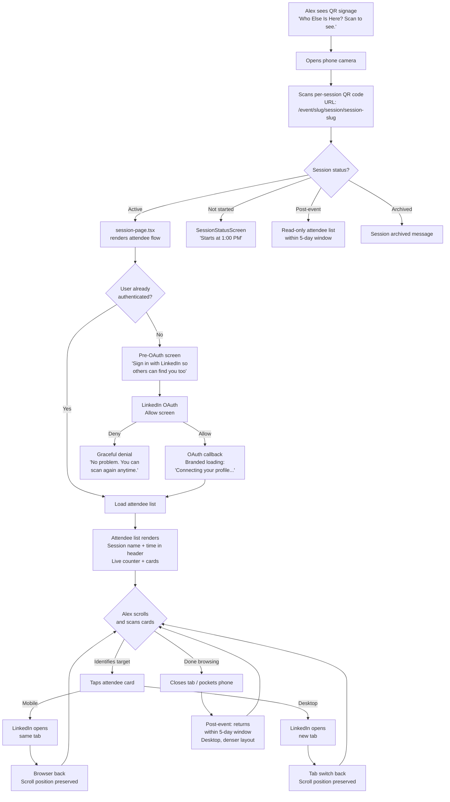
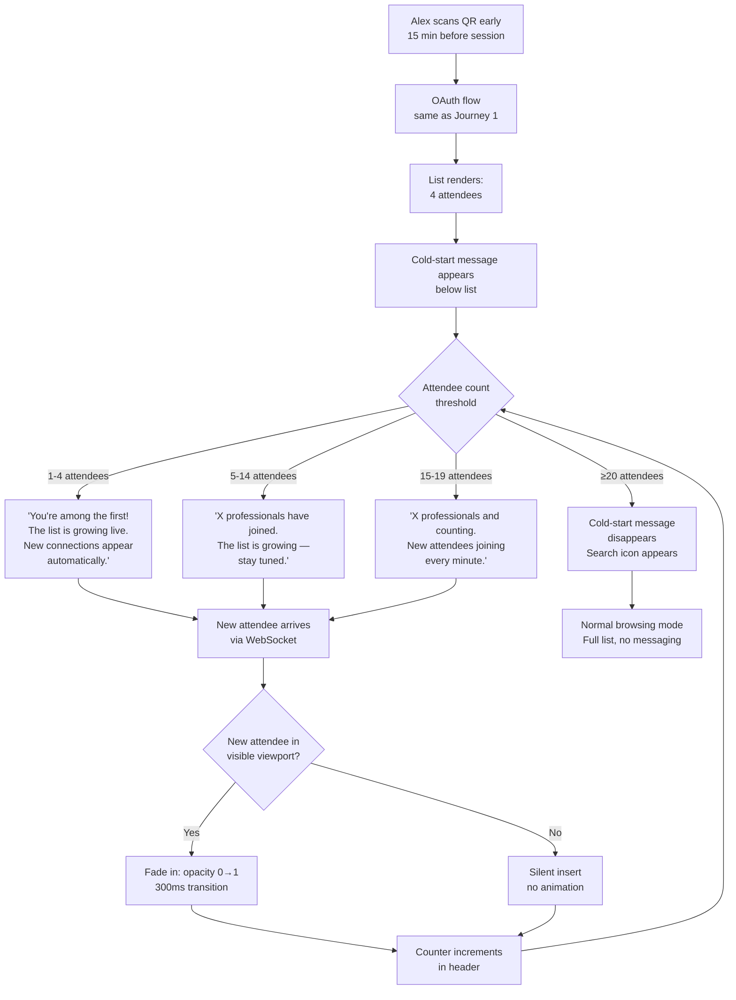
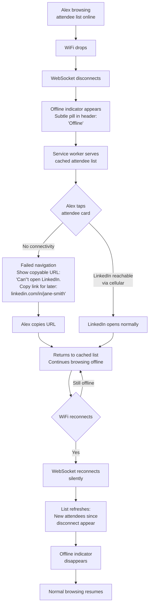
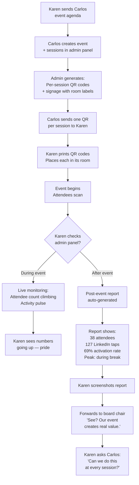
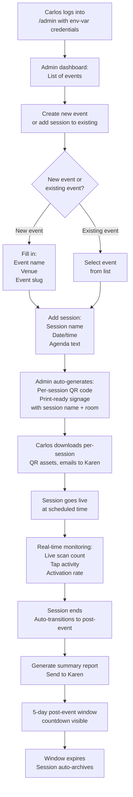
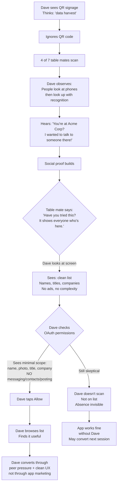

# UX Design Specification: Who Else Is Here

**Author:** Carlos
**Date:** 2026-03-01

---

<!-- UX design content will be appended sequentially through collaborative workflow steps -->

## Executive Summary

*Reviewed through Party Mode expert panel (Sally, John, Winston, Mary, Amelia) — [transcript](_bmad-output/party-mode-transcripts/2026-03-01-ux-design-project-understanding-review.md)*

### Project Vision

Who Else Is Here is a **bridge to LinkedIn, scoped to a live event** — not a networking platform. The entire UX philosophy is radical restraint: the app does ONE thing (show who's here and link to their LinkedIn) and does it in under 30 seconds from QR scan. The product name IS the user's core question, which makes it the most natural value proposition possible.

Two distinct products share the same visual identity:
1. **Web app (SPA)** — The attendee networking tool at `/event/[slug]`. Mobile-first, single-screen, list-based.
2. **Marketing website** — Static landing page for organizer acquisition at the domain root. Persuasion-focused, SEO-optimized.

Both share a Tailwind CSS v4 `@theme` configuration (`packages/shared/theme.css`) — design tokens (colors, typography, spacing, border radius) are defined once as CSS custom properties and enforced across both products. All design decisions must map cleanly to Tailwind's utility class system: 4px spacing grid, responsive breakpoints (`sm`, `md`, `lg`), and structured color palette.

**Design Specification Purpose:** This document is a build specification for AI developer agents. Every design decision is stated with specific values (font sizes, weights, colors, spacing, breakpoints) — no vague directions. An AI agent should be able to implement any screen from this document on the first pass without asking clarifying questions.

### Target Users

**Alex (Attendee)** — Any professional at an event. Mobile-first, one-handed, standing in a crowd, being bumped. Alex's attention is split between the phone and the room. The app must be glanceable — scan a name, make a decision, look up, walk over. Alex doesn't read; Alex scans. The core loop is: scroll → identify → tap → LinkedIn → back. Every second of friction between "see a name" and "land on LinkedIn" is a lost connection.

**Karen (Organizer)** — Never uses the attendee networking screen. Her interface is the admin panel: event creation, monitoring, analytics, reports. Karen is not tech-savvy. She forwards reports to sponsors and church leadership. Her UX must feel like "looking at a dashboard," not "operating software." The post-event report is Karen's "screenshot moment" — the artifact she shares to prove her event creates value.

**Dave (Anti-Persona)** — Privacy-conscious skeptic. The app must not look like it's trying too hard. Minimal OAuth permissions, clean UI, no dark patterns. Dave converts through social proof from other attendees, not through the app's design.

### Key Design Challenges

**1. The 30-Second Promise (make or break)**
From QR scan to browsing the attendee list must feel effortless. LinkedIn OAuth is an interruption in the middle of this flow — the one moment where the app demands attention and trust. The OAuth screen is outside our control, but everything before and after it must be frictionless and fast. The loading/transition states between OAuth callback and list rendering are critical micro-moments.

**2. Cold-Start Survival**
The first 5-10 attendees see a nearly empty list. This is the moment most apps die — "nobody's using this." The tiered messaging must create anticipation, not apologize for emptiness. The UX challenge is emotional, not informational: make 4 people on a list feel like the beginning of something exciting, not the end of something abandoned. Design must provide TWO cold-start experiences: one with subtle animation for default users, one without for `prefers-reduced-motion` users — both conveying the same anticipation through different means.

**3. Event-Context Constraints**
Users are standing, one-handed, in venues with poor lighting and unpredictable WiFi. The entire attendee card design must work at arm's length in bright sunlight or dim conference rooms. Touch targets aren't just an accessibility requirement — they're a physical-environment requirement. Every tap that misses at an event is a broken moment.

**4. Two Products, One Brand**
The marketing website and the web app must feel like they belong to the same product. A Karen who visits `whoelseishere.com` and then sees the QR code at her event needs visual continuity. But the two products serve different purposes: marketing = persuade, app = do. The shared Tailwind config enforces visual consistency; the design must flex between selling and serving within that constraint system.

**5. Admin vs. Attendee — Completely Different Users, Same Product**
The admin panel (Karen/Carlos) and the attendee view (Alex) are almost two different applications. The attendee view is a single screen with a list. The admin panel has event creation, real-time monitoring, analytics charts, and report export. Architecture note: code splitting separates admin and attendee bundles, meaning the admin panel can use heavier charting libraries without affecting the attendee-side PWA cache budget (<2MB). More visual freedom in admin than in the attendee view.

**6. The Report as Karen's Proof**
Karen's post-event summary report isn't just data — it's proof that her event creates value. It's the artifact she screenshots, forwards to sponsors, and shows to church leadership. The report must look like professional business intelligence output, not a developer log dump. Report format, layout, and visual quality directly affect whether Karen becomes a repeat user. This is an organizer conversion moment disguised as a data export.

### Design Opportunities

**1. The Name AS the Experience**
"Who Else Is Here?" is the most natural headline, QR code prompt, cold-start message, and empty-state question imaginable. The product name should echo through every UX touchpoint: the QR code signage says it, the loading screen whispers it, the attendee list answers it. No other event app has a name that doubles as the user's exact internal question.

**2. Social Proof by Design**
The attendee list IS social proof. Every name on the list is evidence that this works. The cold-start messaging can lean into this — not "waiting for attendees" but "4 professionals have already joined. The list is growing live." The real-time counter itself is a conversion mechanic for nearby Daves watching over someone's shoulder.

**3. Radical Simplicity as Categorical Differentiation**
Every competitor (Bizzabo, Swapcard, Whova, Grip) has dense dashboards, feature-heavy navigation, tabs, notification badges, in-app messaging panels. The market has ZERO examples of a minimalist, single-purpose event networking tool. The UX must make this product **instantly recognizable as categorically different** from the enterprise event tech ecosystem. First glance: "This is something new." Not "This is another Eventbrite." White space, typography, and micro-interactions should signal deliberate restraint — a high-end restaurant with a 5-item menu, not a food truck that ran out of options.

**4. Post-Event Desktop Experience**
The 5-day post-event window on desktop is an underexplored opportunity. Alex returns from home on a laptop — larger screen, keyboard, different context (reflective follow-up mode vs. real-time discovery mode). The responsive layout shifts from "glanceable mobile directory" to "thoughtful networking review." Hover states, keyboard navigation, denser layout — desktop post-event is where Alex methodically processes connections made at the event.

### Implementation Constraints from Architecture

| Constraint | UX Impact |
|---|---|
| Tailwind CSS v4 shared config | All design tokens (colors, type, spacing) must be Tailwind-compatible values |
| 4px spacing grid | All spacing decisions in multiples of 4px |
| Responsive breakpoints (`sm`/`md`/`lg`) | Design at mobile-first, then `md` (tablet/small desktop), then `lg` (full desktop) |
| Virtualized attendee list | New-attendee entry animations must be simple (opacity fade, not slide-in) |
| PWA cache <2MB (attendee side) | Minimal asset weight for attendee views; admin has more freedom |
| `prefers-reduced-motion` | All animations need a static alternative |
| WCAG 2.1 AA (8 enforcement rules) | 44px touch targets, 4.5:1 contrast, ARIA labels, keyboard nav, focus preservation |
| AI developer agents implement | Every design decision must be unambiguous with specific values — no "make it feel premium" |

## Core User Experience

### Defining Experience

**The ONE interaction:** Tap a name → land on their LinkedIn profile. That's it. Everything in the app exists to make that tap happen. The attendee list is the menu; LinkedIn is the restaurant. We don't serve the food — we seat you at the right table.

**The core loop (Alex):**
```
Scroll → Identify (name, title, company, photo) → Decide → Tap → LinkedIn → Back → Repeat
```

Each cycle should take **3-5 seconds**. The attendee card must deliver enough information for a go/no-go decision without tapping. Alex should never need to open a profile to decide IF they're interested — only to take action once they ARE interested.

**The core loop (Karen):**
```
Open admin → Glance at dashboard → See numbers that tell a story → Export proof → Share
```

Karen's loop is less frequent but higher stakes. She opens the admin panel once during the event (monitoring) and once after (report). Each visit must deliver instant comprehension — no learning curve, no configuration, no drill-down required to get the headline metrics.

### Platform Strategy

**Primary platform:** Mobile web (PWA/SPA). Phone in hand, one-handed, portrait orientation at live events.

**Secondary platform:** Desktop web. Post-event follow-up from home/office. Same app, responsive layout, keyboard-navigable.

**Touch vs. keyboard:**
- At event (mobile): 100% touch. Large tap targets (44px min). Thumb-zone optimized — primary actions in the bottom 60% of the screen.
- Post-event (desktop): Mouse/keyboard. Hover states on attendee names. Tab navigation through list. Enter to open LinkedIn (new tab on desktop vs. navigate on mobile).

**Offline capability:** PWA service worker caches attendee list on first load. Offline = browsable list + offline indicator + copyable LinkedIn URLs. No functionality degradation except real-time updates pause.

**Device reality:** Budget Android phones (3+ years old) at career transition events. Performance and asset weight are first-class UX concerns, not afterthoughts.

### Effortless Interactions

**1. QR Scan → List (zero cognitive load)**
The scan opens a browser. The browser shows a LinkedIn OAuth screen. After auth, the list appears. At no point does the user make a decision more complex than "Allow" on the OAuth screen. No onboarding, no tutorial, no "set up your profile," no "choose your interests." Just: scan → allow → see everyone.

**2. Real-time list updates (zero user action)**
New attendees appear on the list without refresh, without pull-to-refresh, without any gesture. The list is alive. During cold-start, this aliveness is the retention mechanism — each new name is a micro-reward.

**3. LinkedIn profile navigation (zero intermediary)**
Tap a name → LinkedIn opens. No profile card popup. No "view details" modal. No confirmation dialog. The attendee card IS the detail — name, title, company, photo. The tap IS the action. One gesture, one result.

**4. Offline resilience (zero disruption)**
WiFi drops. The list stays. A subtle indicator appears. Alex keeps browsing. WiFi returns. The list catches up. Alex never notices the gap unless they were watching for new arrivals during the dropout.

**5. Event lifecycle (zero admin intervention)**
Event ends → status transitions automatically → post-event window opens → feedback prompt triggers once → 5 days pass → event archives. Karen never touches a button for any of this.

### Critical Success Moments

**Moment 1: First List Load (the "aha")**
Alex sees 20+ names with photos, titles, and companies. The instant reaction: "I can see everyone who's here." This is the product's entire value proposition delivered in a single screen. If this moment doesn't land — if the list looks empty, broken, slow, or confusing — nothing else matters. **Design priority: highest.**

**Moment 2: The Relevant Name (the "find")**
Alex scrolls and spots someone — "VP of Partnerships at [target company]." Recognition + excitement. The attendee card must deliver enough context for this recognition to happen at scroll speed. Name and company must be the most visually prominent elements. **Design priority: card hierarchy.**

**Moment 3: The LinkedIn Landing (the "bridge")**
Alex taps → LinkedIn opens → the right profile appears. The bridge worked. The app has done its job. If this tap fails, shows the wrong profile, or takes too long, the entire trust model breaks. **Design priority: reliability + speed.**

**Moment 4: Cold-Start Retention (the "wait")**
4 people on the list. The messaging says "You're among the first. The list is growing live." A new name appears while Alex watches. Dopamine. Another name. Alex keeps the tab open. The cold-start didn't kill the experience — it created anticipation. **Design priority: emotional copywriting + live update visibility.**

**Moment 5: Karen's Report Screenshot (the "proof")**
Karen opens the post-event report. Clean numbers. Professional layout. "38 attendees, 127 taps, peak activity during the break." She screenshots it. Forwards it to her board chair. "See? Our event creates real professional value." **Design priority: report visual quality.**

**Moment 6: Dave's Conversion (the "peer pressure")**
Dave watches 4 people at his table scan. He sees them looking at screens, then looking up with recognition. Someone says "the VP of Engineering from Delta is here tonight!" Dave scans. The app doesn't convert Dave — the social proof around the app does. But the app must look clean and trustworthy enough that when Dave finally scans, the OAuth screen doesn't scare him away. **Design priority: trust signals + minimal permission display.**

### Experience Principles

**1. One Screen, One Purpose**
The attendee view is a list. That's the product. No tabs, no navigation, no hamburger menu, no settings. The screen answers one question: "Who else is here?" Everything on screen serves that answer. If an element doesn't help Alex identify a connection, it doesn't belong.

**2. Glanceable, Not Readable**
Alex is at an event, not at a desk. Every piece of information must be scannable at arm's length in 1-2 seconds. Names are large. Titles are secondary but visible. Photos provide instant recognition. The card hierarchy is: Photo → Name → Title/Company. Never: paragraph of text → tiny profile link.

**3. Speed IS the Feature**
Not "fast" as a nice-to-have. Speed is the core differentiator. 30 seconds to first list. <1 second tap-to-LinkedIn. Instant real-time updates. Zero-effort offline fallback. Every millisecond of delay is a competitor advantage returned to Bizzabo.

**4. Trust Through Restraint**
The app asks for minimal LinkedIn permissions. It shows no ads. It has no notifications. It doesn't try to keep Alex in the app — it actively pushes Alex OUT to LinkedIn. This restraint builds trust: "This thing just does what it says." Dave converts because nothing about the app feels manipulative.

**5. The Name Echoes Everywhere**
"Who Else Is Here?" is the QR code prompt, the loading message, the cold-start question, the marketing headline, and the existential answer the product provides. The name is the UX. Every touchpoint reinforces the same question → answer loop.

**6. Karen Sees Proof, Not Data**
The admin experience translates raw metrics into narrative evidence. Not "127 tap events logged" but "127 LinkedIn connections facilitated." Not "scan count: 38" but "69% of attendees activated." Karen doesn't interpret data — the UX interprets it for her.

## Desired Emotional Response

### Primary Emotional Goals

**For Alex (Attendee) — "Connected and Empowered"**

The dominant emotion is **agency** — the feeling of being equipped to act. Alex arrives at an event surrounded by strangers. The app transforms that anonymous crowd into a directory of named, titled, reachable professionals. The emotional shift: from **passive attendee** ("I hope I meet someone useful") to **active networker** ("I know exactly who to approach"). This is not excitement or delight — it's quiet empowerment. The feeling of having information others don't.

**For Karen (Organizer) — "Validated and Proud"**

Karen's emotional goal is **proof of impact**. She organized an event. She hoped it would create value. The analytics report confirms it did — 38 attendees, 127 LinkedIn taps, peak activity during the networking break. The emotion: professional pride backed by evidence. The feeling of forwarding that report to her board chair and knowing it looks impressive. Not "the software works" but "my event works, and I can prove it."

**For Dave (Anti-Persona) — "Respected and Unhurried"**

Dave converts through absence of pressure. The app never asks, nudges, or reminds. No push notifications, no "your colleagues are using this!" guilt. When Dave finally scans the QR code, the emotion should be: "This seems reasonable." Not converted — *unconvinced that there's a reason NOT to try*. Respect for Dave's skepticism is itself the conversion mechanism.

### Emotional Journey Mapping

| Stage | Alex's Emotion | Design Lever |
|---|---|---|
| **QR Scan** | Curiosity ("What is this?") | Product name on signage answers the question before it's asked |
| **OAuth Screen** | Brief hesitation → Trust | Minimal permissions (profile only). Fast return. No dark patterns |
| **First List Load** | Surprise → Empowerment ("I can see everyone") | Instant rendering. Names + photos + titles. No loading spinners longer than 1s |
| **Scrolling** | Focused scanning → Recognition ("I know that company") | Card hierarchy: Photo → Name → Title/Company. Scannable at arm's length |
| **Finding a Target** | Excitement → Intent ("I need to talk to them") | Tap target is the entire card. One gesture to LinkedIn |
| **LinkedIn Landing** | Satisfaction → Confirmation ("That's the right person") | Correct profile opens. Bridge worked |
| **Returning to List** | Momentum ("Who else?") | Back button returns to exact scroll position. List hasn't reshuffled |
| **Cold Start (≤5)** | Uncertainty → Anticipation | "You're among the first" messaging. Live counter. New names appear in real-time |
| **Offline** | No disruption | Subtle indicator. List stays. Browsing continues |
| **Post-Event (Desktop)** | Reflective follow-up ("Let me reconnect with...") | Denser layout. Hover states. Methodical review mode |

| Stage | Karen's Emotion | Design Lever |
|---|---|---|
| **Event Creation** | Competence ("I can do this") | Minimal form fields. Smart defaults. No configuration overwhelm |
| **Live Monitoring** | Pride + Excitement ("People are using it!") | Real-time attendee count. Activity pulse. Numbers going up |
| **Post-Event Report** | Professional validation ("My event delivered value") | Clean BI-style layout. Narrative metrics ("69% activation rate"). Screenshot-ready |
| **Sharing Report** | Confidence ("This makes me look good") | Professional formatting. No developer-facing language. Sponsor-ready |

### Micro-Emotions

**Critical Micro-Emotions to Protect:**

| Micro-Emotion | Threat | Design Response |
|---|---|---|
| **Confidence** (vs. Confusion) | Too many UI elements, unclear next action | One screen. One action. No navigation. The list IS the app |
| **Trust** (vs. Skepticism) | OAuth permissions, data collection fears | Display "read-only profile access" before OAuth. No email, no connections. Just your name and title |
| **Momentum** (vs. Friction) | Slow loads, broken back-navigation, lost scroll position | Service worker caching. Scroll position preservation. Sub-second transitions |
| **Belonging** (vs. Isolation) | Empty list, feeling like "nobody else is using this" | Tiered cold-start messaging. Live counter. Each new name is social proof |
| **Accomplishment** (vs. Frustration) | Tap leads to wrong LinkedIn profile or dead link | LinkedIn URL validation at scan time. Profile photo confirmation on card |
| **Safety** (vs. Exposure) | "Who can see that I'm here?" anxiety | No visibility into who's viewing. No "last seen." No activity broadcasting. Presence is passive |

**Micro-Emotions to Actively Create:**

- **Anticipation** during cold start — "The list is growing live" with real-time additions
- **Delight** at list density — seeing 20+ professionals with photos feels like having a cheat code
- **Relief** at simplicity — "This is ALL it does? Perfect." No feature bloat to navigate
- **Agency** in the scroll — every card is a potential introduction waiting to happen

### Design Implications

**Confidence → Radical simplicity**
No hamburger menus. No settings gear. No notification bells. No tabs. The attendee list occupies the full viewport. The only interactive element is the attendee card (tap → LinkedIn). Confidence comes from having nothing to figure out.

**Trust → Transparency over persuasion**
The OAuth screen shows minimal permissions. The app doesn't try to retain attention — it pushes users OUT to LinkedIn. No analytics tracking language visible to attendees. No "we collect" disclosures beyond what's legally required. Trust is built by what the app visibly does NOT do.

**Momentum → Invisible performance**
Every transition under 300ms. Scroll position preserved on back-navigation. Offline mode seamless — no error modals, no "retry" buttons, just a subtle connectivity indicator. The app should feel like it's running locally, not over a network.

**Belonging → Social proof by design**
The attendee count is always visible. During cold start, the count is positioned as "growing" not "small." Each new real-time addition reinforces that others are joining. The list itself is the social proof — density = credibility.

**Safety → Privacy through absence**
No read receipts. No "who viewed your profile." No activity feed. No "Alex is browsing the list." Attendees are visible by name, but their behavior is invisible. This absence of surveillance IS the privacy design.

**Professional Pride (Karen) → Report as artifact**
The post-event report uses clean typography, structured sections, and narrative metrics. It looks like a McKinsey deck, not a database export. Color-coded charts. Headline numbers with supporting context. Karen screenshots it without needing to crop or edit.

### Emotional Design Principles

**1. Empower, Don't Entertain**
This is not a delightful app. It's a powerful one. No confetti animations, no gamification, no streaks. The emotional register is professional confidence, not consumer playfulness. Alex feels equipped, not amused. The design vocabulary: clean, structured, trustworthy — like a Bloomberg terminal for event networking, not a Tinder for conferences.

**2. Absence Creates Trust**
Every feature NOT included is a trust signal. No notifications = "we won't spam you." No in-app messaging = "we're not trying to replace LinkedIn." No profile customization = "we don't want your time." Dave converts because the app conspicuously lacks the manipulative patterns he expects from tech products.

**3. Speed IS the Emotional Experience**
The "feeling" of the app is inseparable from its performance. A 3-second load doesn't feel "a little slow" — it feels broken. A 200ms transition doesn't feel "fast" — it feels instant. Speed is not a technical metric; it's an emotional one. Every performance optimization is an emotional design decision.

**4. The List IS the Reward**
No progressive disclosure. No unlock mechanics. No "complete your profile to see more." The full attendee list is the product, and it's available immediately after OAuth. The emotional reward is instant and complete — not drip-fed. This generosity builds trust and creates the "aha" moment on first load.

**5. Professional Silence Over Social Noise**
The app communicates only when necessary. No welcome toast. No "tip of the day." No "you have 3 new attendees!" notification. The list updates silently. The offline indicator appears subtly. Information is present when needed, invisible when not. This silence signals respect for Alex's attention — which is split between the phone and the room.

**6. Karen's Screenshot Test**
Every admin-facing screen must pass the "screenshot test": if Karen screenshots it and forwards it to her board chair with zero context, does it communicate value? If the screenshot requires explanation, the design has failed. Numbers should be large, labels should be plain English, and the visual hierarchy should tell a story without narration.

## UX Pattern Analysis & Inspiration

### Inspiring Products Analysis

**1. Apple Contacts / Google Contacts — The Directory as Product**

What they do well: The contact list is the entire UI. No onboarding. No tutorials. Open the app → see names → tap to act. The information hierarchy is identical to ours: Photo → Name → Secondary info. Scrolling is the primary interaction. Search is the secondary interaction. There is no tertiary interaction.

UX lessons for Who Else Is Here:
- **Card density matters.** Contacts apps show 8-10 entries per viewport on mobile. Enough to scan quickly, not so dense that tap targets overlap. Our attendee list should target the same density.
- **Alphabet scrolling is familiar.** Users expect alphabetical ordering in a directory. Our default sort should be alphabetical by first name — it matches the mental model of "looking someone up."
- **The tap target is the entire row.** Not a small "view" button. Not an icon. The whole row. One gesture, one result.

**2. LinkedIn Mobile — The Profile Card Pattern**

What they do well: LinkedIn's connection request cards show the exact information needed for a professional go/no-go decision: photo, name, title, company, mutual connections. The card answers: "Do I know this person? Should I know this person?" in under 2 seconds.

UX lessons for Who Else Is Here:
- **Photo is the anchor.** The eye hits the photo first, then scans right to the name. This is not a design choice — it's how visual cognition works. Our attendee card must lead with the photo.
- **Title + Company is one unit.** LinkedIn displays "VP of Engineering at Google" as a single line, not two separate fields. This reads faster than stacking them. Our card should combine title and company into one secondary text line where viewport allows.
- **Minimal chrome around the card.** LinkedIn cards have almost no borders, shadows, or decorative elements. The content IS the visual element. Our attendee cards should follow: no card borders, minimal separation (a 1px divider line or 8px gap), content-forward.

**3. WhatsApp / Signal — Real-Time List Updates**

What they do well: New messages appear at the top of the conversation list without any user action. No pull-to-refresh needed. The list is alive — items reorder, badges update, timestamps change. Users trust that what they see is current.

UX lessons for Who Else Is Here:
- **New items appear without fanfare.** WhatsApp doesn't show a "3 new messages — tap to load" banner. New conversations just appear. Our new attendees should fade in (opacity 0→1 over 300ms) without requiring user action.
- **No "pull to refresh" crutch.** If the list updates in real-time, pull-to-refresh is a signal that the real-time system isn't trusted. We should NOT implement pull-to-refresh — it undermines the "live list" promise.
- **Subtle timestamp = freshness signal.** WhatsApp shows relative timestamps ("2 min ago"). Our attendee list could show a relative "joined" time during the event — "joined 2 min ago" — as a freshness signal that reinforces the list is live.

**4. Uber — Single-Purpose, Context-Aware, Zero Navigation**

What they do well: Uber opens to a map with one input: "Where to?" No menu to navigate. No settings to configure. No profile to set up. The app assumes context (you need a ride, you're at this location) and presents the single action. The entire experience is: open → input → confirm → done.

UX lessons for Who Else Is Here:
- **Context is pre-loaded.** Uber knows your location. We know the event (from the URL slug). No "select your event" screen. No "which event are you attending?" The URL IS the context.
- **The primary action dominates the viewport.** Uber's map + destination input occupies 90% of the screen. Our attendee list should occupy 90%+ of the viewport. Header/footer chrome should be minimal.
- **Progressive information delivery.** Uber shows your driver's name, photo, car, rating, ETA — layered from most important to least. Our attendee card layers: Photo → Name → Title/Company. Same principle: most important info has the most visual weight.

**5. Stripe Dashboard — Professional Analytics That Tell Stories**

What they do well: Stripe's dashboard translates raw transaction data into narrative business intelligence. "Your revenue grew 23% this month" — not "SELECT SUM(amount) FROM transactions." Large headline numbers. Clean charts. Plain English labels. The dashboard is designed to be screenshot and shared with investors.

UX lessons for Who Else Is Here (Karen's admin panel):
- **Headline metric is a single large number.** Stripe shows "$42,389 today" in 32px+ font. Karen's dashboard should show "38 Attendees" in the same visual weight. The number IS the story.
- **Contextual comparison.** Stripe shows "↑ 23% vs last month." Karen's report could show "69% activation rate" with context: "industry average: 15-25%." Makes the number meaningful without Karen needing domain expertise.
- **Export-ready design.** Stripe's reports look professional when exported. No debug info, no developer labels, no raw IDs. Karen's post-event report must meet the same bar — every element screenshot-ready.

### Transferable UX Patterns

**Navigation Patterns:**

| Pattern | Source | Application to Who Else Is Here |
|---|---|---|
| No navigation (single-screen) | Uber, Contacts | Attendee view has zero navigation elements. The list IS the app. No hamburger, no tabs, no bottom bar |
| URL-as-context | Uber (location), Google Docs (URL) | `/event/[slug]` eliminates "select your event" screens. The URL pre-loads everything |
| Back = browser back | Mobile web convention | No custom back button. Browser back returns to the list from LinkedIn. Native behavior, zero learning |

**Interaction Patterns:**

| Pattern | Source | Application to Who Else Is Here |
|---|---|---|
| Full-row tap target | Contacts, WhatsApp | Entire attendee card is tappable. No small "view profile" buttons. 44px+ minimum height |
| Silent real-time updates | WhatsApp, Signal | New attendees fade in without banners, toasts, or "tap to load" prompts |
| Scroll position preservation | Instagram, Twitter | Returning from LinkedIn restores exact scroll position. Critical for the browse → tap → return loop |

**Visual Patterns:**

| Pattern | Source | Application to Who Else Is Here |
|---|---|---|
| Photo-led card layout | LinkedIn, Contacts | 40px circular photo left-aligned. Name + secondary info right of photo. Scannable at arm's length |
| Content-forward (minimal chrome) | LinkedIn cards, Apple Design | No card borders or shadows. Content separated by subtle dividers or spacing. The data IS the design |
| Headline number dashboard | Stripe, Square | Karen's admin: single large metric dominates viewport. Supporting metrics smaller below. Story in 2 seconds |

**Information Architecture Patterns:**

| Pattern | Source | Application to Who Else Is Here |
|---|---|---|
| Alphabetical default sort | Contacts, phone directories | Attendees sorted A-Z by first name. Matches universal "looking someone up" mental model |
| Search as progressive filter | Contacts, Slack | Search bar at top. Typing filters the list in real-time. No "submit" button — instant filter as you type |
| Contextual empty states | Slack, Notion | Cold-start messaging adapts to count. Not generic "no results" — specific, encouraging, action-oriented |

### Anti-Patterns to Avoid

**1. The "Feature Discovery Tour" (Slack, Notion)**
Multi-step onboarding walkthroughs with tooltips, modals, and "got it" buttons. Our app has ONE feature. No tour needed. If the attendee list requires explanation, the design has failed.

**2. The "Social Feed Refresh" (Twitter/X, Instagram)**
Pull-to-refresh with loading spinners and "New posts" banners at the top. This pattern implies the list might be stale. Our list is live via WebSocket — pull-to-refresh would undermine trust in real-time updates.

**3. The "Permission Creep" (Facebook, many mobile apps)**
Requesting permissions beyond what's needed. Camera, contacts, location, notifications — each one erodes trust. Our OAuth requests ONLY the LinkedIn profile scope. No email, no connections, no posting ability. Dave notices what we DON'T ask for.

**4. The "Engagement Loop" (LinkedIn, Instagram, TikTok)**
Notifications, badges, streaks, "people are looking at your profile" nudges. These patterns retain attention. Our app deliberately pushes users OUT to LinkedIn. No notifications. No engagement mechanics. No reasons to stay in the app longer than necessary.

**5. The "Dashboard Overload" (Bizzabo, Swapcard, enterprise event platforms)**
20+ metrics, multiple tabs, configurable widgets, drill-down reports. Karen doesn't want a BI tool — she wants proof. Our admin panel shows 3-5 headline metrics with narrative labels. One screen. No configuration. No drill-down required for the headline story.

**6. The "Confirmation Dialog" (many enterprise apps)**
"Are you sure you want to open this profile?" — No. Tap → LinkedIn. One gesture, one result. Confirmation dialogs are for destructive actions (delete, send), not for navigation. Every extra tap is a broken moment at an event.

**7. The "Card Expansion" (Material Design, many list apps)**
Tap a card → card expands in-place to show more details. This pattern works when there's hidden information worth revealing. Our attendee card shows ALL relevant info on the surface: photo, name, title, company. There is no "more details" to reveal. The tap goes to LinkedIn, not to an expanded card.

### Design Inspiration Strategy

**What to Adopt Directly:**

| Pattern | Why | Implementation Note |
|---|---|---|
| Full-row tap target (Contacts) | Matches event context: standing, one-handed, imprecise taps | Entire attendee card row is the tap target. `min-h-11` (44px) Tailwind |
| Photo-led card hierarchy (LinkedIn) | Professional context demands instant recognition. Photo → Name → Title/Company | 40px circular avatar, `font-semibold` name, `text-gray-600` secondary |
| Silent real-time list updates (WhatsApp) | Reinforces "live" promise. No interruption to browsing | Opacity fade 0→1 over 300ms. `prefers-reduced-motion`: instant appear |
| Headline number dashboard (Stripe) | Karen needs story, not data. Large number = instant comprehension | `text-4xl font-bold` for primary metric. Plain English label below |
| URL-as-context (Uber) | Zero configuration. The link IS the event | `/event/[slug]` pre-loads event data. No "select event" step |

**What to Adapt:**

| Pattern | Original | Adaptation |
|---|---|---|
| Alphabetical scroll index (Contacts) | Full A-Z sidebar with letter index | Simplified: alphabetical sort default, no letter sidebar (too few entries to need it at pilot scale of 40-200) |
| Search-as-filter (Contacts, Slack) | Persistent search bar always visible | Collapsible: search icon in header expands to input. Preserves list real estate on small screens. Visible only when list exceeds ~15 attendees |
| Freshness timestamp (WhatsApp) | "2 min ago" relative timestamps | "Joined 5 min ago" on recent attendees only (last 10 minutes). After that, no timestamp — it's noise |

**What to Avoid Entirely:**

| Anti-Pattern | Why It Conflicts | Emotional Principle Violated |
|---|---|---|
| Onboarding tour | One-feature app needs no explanation | Confidence → Radical simplicity |
| Pull-to-refresh | Undermines live WebSocket trust | Speed IS the Emotional Experience |
| Notification badges | We push users OUT, not keep them IN | Absence Creates Trust |
| Card expand/collapse | No hidden info to reveal | The List IS the Reward |
| Confirmation dialogs on navigation | Extra tap = broken moment at event | Speed IS the Emotional Experience |
| Dashboard widget configuration | Karen needs answers, not a BI tool | Karen's Screenshot Test |
| Profile completion prompts | OAuth gives us everything we need | Professional Silence Over Social Noise |

## Design System Foundation

### Design System Choice

**Tailwind CSS v4 — Custom utility-first design system.** No component library (no MUI, no Chakra, no Ant Design).

This is a **custom design system built on Tailwind's utility framework** — full visual control without building a CSS framework from scratch.

Why not an established component library:
- **MUI/Chakra/Ant Design** would add 100-300KB to the bundle, threatening the <2MB PWA cache budget
- Component libraries impose visual opinions that fight our "categorically different from enterprise event tech" positioning
- Our attendee view has exactly ONE component (the attendee card in a list). We don't need a library of 80+ components
- Admin panel needs ~10 components. Custom-building 10 components is faster than learning to theme 80

### Rationale for Selection

| Factor | Decision Driver |
|---|---|
| **Architecture mandate** | Tailwind CSS v4.2.0 already specified. Shared `@theme` config (`packages/shared/theme.css`) between SPA and marketing site. Non-negotiable |
| **Bundle weight** | Tailwind's purged output is typically 5-15KB. Component libraries add 100KB+. PWA cache budget <2MB for attendee side |
| **Visual differentiation** | "Categorically different from enterprise event tech" requires custom visual identity. Pre-built component libraries look like pre-built component libraries |
| **AI agent implementation** | Tailwind utilities are the most AI-agent-friendly styling approach. `className="flex items-center gap-3 p-4 min-h-11"` is unambiguous. No CSS-in-JS abstractions, no theme provider nesting, no styled-component indirection |
| **Two products, one config** | Marketing site and web app share the same `@theme` config (`packages/shared/theme.css`). Design tokens defined once. Colors, typography, spacing, border-radius — identical across both products |
| **Team reality** | AI developer agents write the code. Tailwind has the largest training corpus of any CSS framework. Agents produce higher-quality Tailwind output than any other styling approach |

### Implementation Approach

**Single source of truth: `packages/shared/theme.css` (Tailwind v4 `@theme`)**

The `@theme` CSS file IS the design system. Every design decision in this UX specification translates directly to a CSS custom property:

```
packages/shared/theme.css (@theme directives)
├── --color-*            → Brand palette, semantic colors
├── --font-*             → Typography stack
├── --text-*             → Type scale with line-heights
├── --spacing-*          → 4px grid (Tailwind default)
├── --radius-*           → Corner radius tokens
├── --breakpoint-*       → Responsive breakpoints (sm/md/lg)
└── Custom properties    → Shadows, transitions
```

**Consumption pattern:**
- `packages/client/` imports `packages/shared/theme.css` → attendee SPA
- `packages/marketing/` imports `packages/shared/theme.css` → marketing website
- Both produce independently purged CSS bundles — no cross-contamination

**Responsive strategy:**
- Mobile-first (default styles = mobile)
- `sm:` (640px) — large phones in landscape
- `md:` (768px) — tablets, small desktops
- `lg:` (1024px) — desktop post-event experience

**Dark mode:** Not implemented for MVP. Single light theme. The event context (bright venues, outdoor events, conference halls) favors high-contrast light mode. Dark mode is a V2 consideration.

### Customization Strategy

**Layer 1: Tailwind v4 `@theme` (Design Tokens)**
All visual primitives defined in `packages/shared/theme.css` via `@theme` directives. Steps 8 (Visual Foundation) and 9 (Design Directions) specify exact values for:
- Color palette (primary, secondary, neutral, semantic)
- Typography scale (font families, sizes, weights, line-heights)
- Spacing scale (using Tailwind's default 4px grid)
- Border radius tokens
- Shadow definitions
- Transition durations

**Layer 2: Component Classes (Tailwind @apply)**
For repeated patterns (attendee card, admin metric card, button variants), define component classes using `@apply` in a shared CSS file. This keeps the HTML clean while maintaining Tailwind's utility-first approach:
- `.attendee-card` — the full card pattern (layout, spacing, tap target)
- `.metric-card` — Karen's dashboard metric display
- `.btn-primary`, `.btn-secondary` — button variants (admin panel only)
- `.cold-start-message` — styled empty state messaging

**Layer 3: One-Off Utilities (Inline Tailwind)**
For unique, non-repeated styling, use Tailwind utilities directly in JSX. No abstraction needed for one-time use.

**What we do NOT build:**
- No design system documentation site (Storybook, etc.) — overkill for this scope
- No component library package — components live in `packages/client/src/components/`
- No theme provider — Tailwind handles theming through config, not runtime JS
- No CSS variables for dynamic theming — single light theme, no runtime switching

## Defining Experience

*Reviewed through Party Mode expert panel (Sally, John, Winston, Mary, Amelia) — [transcript](_bmad-output/party-mode-transcripts/2026-03-01-ux-defining-experience-review.md)*

### The One Interaction

**"Tap a name → land on their LinkedIn."**

That's the product described in 7 words. If a user explains Who Else Is Here to a friend, this is the sentence. Like Tinder's "swipe to match" or Uber's "tap to ride," the defining experience is a single gesture with a single outcome.

The app's job is to make this tap happen as many times as possible per session. Everything on screen exists to serve this interaction: the photo makes the person recognizable, the name makes them findable, the title/company makes them relevant, and the tap delivers the connection. There is no second interaction.

### User Mental Model

**How Alex currently solves this problem:**
Alex walks into an event. Scans the room. Spots someone's name tag. Squints. Approaches awkwardly. "Hi, what do you do?" Makes small talk to determine if this person is professionally relevant. Realizes after 5 minutes that they're not. Moves on. Repeats.

The alternative: Alex checks the event's LinkedIn group or Eventbrite attendee list before the event. Sees names but no faces. Arrives and can't match names to people. The pre-event list is useless in the room.

**The mental model Alex brings:**
Alex thinks of this app like a **conference name badge, but better.** A name badge shows: name, title, company. This app shows the same thing, plus a photo, plus a direct link to their full professional profile. It's the name badge Alex wishes existed — one that works from across the room and includes a LinkedIn QR code.

**Where the mental model helps:**
- Alex already knows how to scan a list of names (contacts, email, social feeds)
- Alex already knows that tapping a name does something (opens a profile, starts a conversation)
- Alex already knows LinkedIn as the destination for professional connections
- Zero new mental models required. The app uses existing patterns in a new context

**Where confusion could arise:**
- "Why do I need to sign in with LinkedIn?" → Addressed by pre-OAuth messaging: "Sign in so others can find you too"
- "Can people see that I'm looking at them?" → Addressed by absence of any view-tracking or notification
- "Where did this person go?" → Doesn't happen. Attendees are never removed from the list during an event. The list only grows
- "How do I search?" → Search icon appears when list reaches 20 attendees. Below that, scanning is faster than typing

### Success Criteria

**The core interaction succeeds when:**

| Criterion | Metric | How We Know |
|---|---|---|
| **Speed** | QR scan → browsing list in <30 seconds | Measured via journey_events: time between scan event and first browse event |
| **Accuracy** | Tap → correct LinkedIn profile 100% of the time | LinkedIn URL validated at OAuth. Profile photo confirms identity on the card |
| **Density** | 3-5 seconds per card decision (scan → tap or skip) | Card hierarchy delivers enough info for go/no-go without expanding or drilling in |
| **Liveness** | New attendees appear without user action | WebSocket push. Opacity fade. No refresh required. The list grows while Alex watches |
| **Resilience** | Works on poor WiFi and budget devices | Service worker cache. Offline browsing. Sub-200ms transitions on 3-year-old Android |

**Title handling constraint:** Long titles (e.g., "Senior Vice President of Business Development and Strategic Partnerships") must be handled gracefully. Mobile: single line with ellipsis truncation (`truncate` Tailwind class). Desktop (`md:` breakpoint and above): up to two lines allowed (`line-clamp-2`). Title + company combined as one secondary text unit where viewport allows.

**Critical Implementation Requirement — Scroll Position Preservation:**
This is the **highest-risk UX failure mode** in the core loop. If Alex taps a name, LinkedIn opens, and the back button reloads the list at the top, the entire browse-tap-return loop breaks. The user loses their place in a list of 200 people. Scroll position MUST be preserved on back-navigation. This is not optional. Implementation approaches: React state persistence, `scrollRestoration: 'manual'`, or virtualized list offset storage. The developer agent must verify this works on both iOS Safari and Chrome Android.

### Novel UX Patterns

**This product uses ZERO novel patterns.** That is the innovation — and the competitive advantage.

Every interaction maps to a pattern Alex already knows:

| Interaction | Established Pattern | Source |
|---|---|---|
| Browse a list of names | Contact list scrolling | Phone contacts, email, WhatsApp |
| Tap a name to act | Row-tap navigation | Every list-based mobile app |
| See new items appear live | Real-time feed updates | WhatsApp, Slack, social feeds |
| Search within a list | Filter-as-you-type | Contacts, Slack, Spotlight |
| Sign in with OAuth | "Continue with [provider]" | Google, Facebook, Apple sign-in |

**Competitive positioning:** While competitors (Bizzabo, Grip, Swapcard) invest in novel recommendation algorithms, smart matchmaking, and AI-powered networking — patterns that require learning, configuration, and scale to function — Who Else Is Here uses universally familiar patterns that work perfectly at any event size. The "novelty" is contextual (a live directory scoped to this event), not interactional. At an event, standing in a crowd, Alex has zero patience for learning new interaction patterns.

**The one near-novel pattern: cold-start messaging.**
An attendee list with 4 names could feel broken or abandoned. The tiered cold-start messaging maps to a familiar pattern: progress indicators. "4 professionals have joined. The list is growing live." is functionally a progress bar with copy — a pattern Alex has seen in file downloads, app installations, and game loading screens.

### Experience Mechanics

**1. Initiation — The QR Scan**

| Step | What Happens | Duration |
|---|---|---|
| Alex sees QR signage | Signage reads: "Who Else Is Here? Scan to see." | 0s (passive) |
| Alex opens camera | Native phone camera, no app install | 2-3s |
| Phone reads QR code | URL: `whoelseishere.com/event/[slug]` | <1s |
| Browser opens | Landing on the event page | 1-2s |

**2. Authentication — The OAuth Bridge**

| Step | What Happens | Duration |
|---|---|---|
| Pre-OAuth screen | Brief message: "Sign in with LinkedIn so others can find you too" | 1-2s (reading) |
| LinkedIn OAuth screen | Standard LinkedIn "Allow" permission dialog. Profile only — no email, no connections | 3-5s (user decision) |
| OAuth callback processing | Branded loading screen: event name + "Connecting your profile..." Server exchanges auth code → fetches profile → creates record → creates session | 2-8s (network-dependent) |

The OAuth callback duration is variable (2s on good WiFi, up to 8s on congested event venue WiFi with 200 concurrent users). The loading screen must be branded and informative — not a generic spinner. Show: event name, "Connecting your profile..." message, and the Who Else Is Here logo. This is the last screen before the "aha" moment of seeing the list.

**3. The Core Loop — Browse, Identify, Tap**

| Step | What Happens | Duration |
|---|---|---|
| List renders | Full attendee list appears. Sorted alphabetically. Photos, names, titles visible | <1s after callback |
| Alex scrolls | Thumb scrolls through attendee cards. 8-10 cards visible per viewport | Continuous |
| Alex identifies | Spots a relevant name/title/company. Card provides enough info for go/no-go | 1-2s per card |
| Alex taps | Entire card is the tap target. Tap opens LinkedIn profile | <1s to navigate |
| LinkedIn loads | **Mobile:** LinkedIn opens in same tab. **Desktop:** LinkedIn opens in new tab (`target="_blank"`) | 1-3s (external) |
| Alex returns | **Mobile:** Browser back button. **Desktop:** Tab switch back to app. Both restore exact scroll position | <1s |
| Repeat | Back to scrolling. Find the next connection | Continuous |

**4. Feedback — What Tells Alex It's Working**

| Signal | Implementation |
|---|---|
| List density | 20+ names with photos = "This is working, people are here" |
| Live counter | "38 professionals here" in header — number grows in real-time |
| New arrivals | Names fade in (opacity 0→1, 300ms) **only when inserted within the visible viewport**. Off-screen insertions are silent — no animation, no scroll jump. `prefers-reduced-motion`: instant appear, no fade |
| Tap response | Immediate navigation to LinkedIn — no loading state between tap and LinkedIn |
| Scroll preservation | Returning from LinkedIn = exact same position. The app "remembers" |
| Offline indicator | Subtle "offline" pill appears. List stays browsable. Reconnects silently |
| Search availability | Search icon appears in header when attendee count reaches **20**. Below 20, no search — scanning is faster than typing |

**5. Completion — There Is No "Done"**

The defining experience has no completion state. Alex browses until they choose to stop. The app doesn't signal "you've seen everyone" or "you're done." The list is always there, always growing, always available. The session ends when Alex puts the phone in their pocket — not when the app tells them to.

Post-event: the list remains accessible for 5 days. Alex returns from a laptop at home, browses the same list in a denser desktop layout, and methodically follows up on connections made at the event. Same core loop, different context, different device.

## Visual Design Foundation

*Reviewed through Party Mode expert panel (Sally, Winston, Amelia, Mary, Maya) — [transcript](_bmad-output/party-mode-transcripts/2026-03-01-ux-visual-foundation-review.md)*

**Tailwind v4 Implementation Note:** The architecture specifies Tailwind CSS v4.2.0, which uses a CSS-first `@theme` configuration approach — not the v3 `tailwind.config.js` JavaScript file. All design tokens are defined as CSS custom properties in a shared theme file (`packages/shared/theme.css`) imported by both `packages/client` and `packages/marketing`. References below use CSS custom property names (`--color-primary-600`) that map directly to `@theme` directives.

### Color System

**Brand Philosophy:** Professional trust with intentional sophistication. The primary palette uses **indigo** — distinct from LinkedIn's blue (`#0A66C2`), distinct from Tailwind's default blue (`#2563EB`), signaling "crafted, not templated." The color choice reinforces the "categorically different" positioning at the most fundamental visual level.

**Primary Palette (Indigo):**

| Token | Hex | CSS Custom Property | Usage |
|---|---|---|---|
| `primary-50` | `#EEF2FF` | `--color-primary-50` | Subtle primary backgrounds (cold-start banner, selected states) |
| `primary-100` | `#E0E7FF` | `--color-primary-100` | Light primary accents |
| `primary-600` | `#4F46E5` | `--color-primary-600` | Primary actions, active states, links |
| `primary-700` | `#4338CA` | `--color-primary-700` | Hover/pressed states on primary elements |

**Neutral Palette:**

| Token | Hex | CSS Custom Property | Usage |
|---|---|---|---|
| `gray-900` | `#111827` | `--color-gray-900` | Attendee names (primary text). Maximum contrast |
| `gray-700` | `#374151` | `--color-gray-700` | Headings, header text |
| `gray-600` | `#4B5563` | `--color-gray-600` | Title + company (secondary text) |
| `gray-400` | `#9CA3AF` | `--color-gray-400` | Placeholder text, subtle timestamps, dividers |
| `gray-200` | `#E5E7EB` | `--color-gray-200` | Card dividers, borders |
| `gray-100` | `#F3F4F6` | `--color-gray-100` | Page background (attendee view) |
| `gray-50` | `#F9FAFB` | `--color-gray-50` | Card backgrounds, input fields |
| `white` | `#FFFFFF` | — | Card surfaces, header background |

**Semantic Palette:**

| Token | Hex | CSS Custom Property | Usage |
|---|---|---|---|
| `success-500` | `#22C55E` | `--color-success-500` | Online/connected indicator, positive metrics |
| `success-50` | `#F0FDF4` | `--color-success-50` | Success state backgrounds |
| `warning-500` | `#F59E0B` | `--color-warning-500` | Offline indicator, caution states |
| `warning-50` | `#FFFBEB` | `--color-warning-50` | Warning state backgrounds |
| `error-500` | `#EF4444` | `--color-error-500` | Error states (OAuth failure, network error) |
| `error-50` | `#FEF2F2` | `--color-error-50` | Error state backgrounds |

**Contrast Verification (WCAG 2.1 AA):**

| Combination | Contrast Ratio | Pass? |
|---|---|---|
| `gray-900` on `white` | 17.4:1 | Yes (AAA) |
| `gray-900` on `gray-50` | 15.4:1 | Yes (AAA) |
| `gray-600` on `white` | 7.0:1 | Yes (AA) |
| `gray-600` on `gray-50` | 6.2:1 | Yes (AA) |
| `primary-600` on `white` | 5.5:1 | Yes (AA normal text) |
| `gray-400` on `white` | 3.0:1 | Yes (AA large text only — use only for decorative/non-essential text) |

### Typography System

**Font Stack:**

| Role | Font | CSS Custom Property | Rationale |
|---|---|---|---|
| **Primary (UI)** | `Inter` (variable) | `--font-sans: 'Inter Variable', 'system-ui', sans-serif` | Designed for screens. Variable font covers all weights in a single ~90KB file. Google Fonts CDN — fast load. Universal professional tone |
| **Monospace** | `JetBrains Mono` | `--font-mono: 'JetBrains Mono', monospace` | Admin panel only — code-like data display (event slugs, IDs). Not used in attendee view |

**Type Scale:**

| Token | Size | Weight | Line Height | Tailwind Class | Usage |
|---|---|---|---|---|---|
| `display` | 36px | 800 | 40px | `text-4xl font-extrabold` | Karen's headline metrics ("38 Attendees") |
| `h1` | 24px | 700 | 32px | `text-2xl font-bold` | Event name in header, admin page titles |
| `h2` | 20px | 600 | 28px | `text-xl font-semibold` | Section headers (admin panel) |
| `h3` | 16px | 600 | 24px | `text-base font-semibold` | Attendee name on card |
| `body` | 14px | 400 | 20px | `text-sm font-normal` | Title + company on attendee card, body text |
| `caption` | 12px | 400 | 16px | `text-xs font-normal` | Timestamps ("joined 5 min ago"), helper text |
| `label` | 12px | 500 | 16px | `text-xs font-medium` | Form labels, metric labels (admin) |

**Font Loading Strategy:**
- Inter loaded as a single **variable font** file from Google Fonts CDN (`font-display: swap`)
- Variable font covers all weights (100-900) in one ~90KB woff2 file — simpler than loading individual weight files
- Subset to `latin` for minimal payload
- System font fallback (`system-ui`) prevents FOIT — text renders immediately in system font, swaps to Inter on load

### Spacing & Layout Foundation

**Spacing Scale:** Tailwind's default 4px grid. All spacing values in multiples of 4px.

| Token | Value | Tailwind | Common Usage |
|---|---|---|---|
| `space-1` | 4px | `p-1`, `gap-1` | Tight internal padding (icon-to-label) |
| `space-2` | 8px | `p-2`, `gap-2` | Compact element spacing |
| `space-3` | 12px | `p-3`, `gap-3` | Card internal padding (photo-to-text gap) |
| `space-4` | 16px | `p-4`, `gap-4` | Standard section padding, card padding |
| `space-5` | 20px | `p-5`, `gap-5` | Generous section spacing |
| `space-6` | 24px | `p-6`, `gap-6` | Major section separation |
| `space-8` | 32px | `p-8`, `gap-8` | Page-level margins (desktop) |

**Layout Principles:**

**1. Content-to-edge on mobile, contained on desktop.**
Mobile: attendee list runs edge-to-edge (0px horizontal padding on the list container). Card internal padding provides breathing room. Desktop (`lg:`): max-width container (640px) centered — the list doesn't stretch across a 1440px monitor.

**2. Vertical rhythm via consistent card height.**
Every attendee card is the same height (minimum 72px / `min-h-[72px]`). This creates a predictable scroll rhythm — Alex's thumb knows how far to swipe for the next card. Combined with the 44px minimum touch target, the 72px card height provides comfortable tap targets with visual breathing room.

**3. Minimal horizontal layout.**
Attendee card layout: `[Photo 40px] [12px gap] [Name + Title stack] [→ chevron 20px]`. Left-to-right, single row, no wrapping. The chevron (a subtle `gray-400` right arrow) signals tappability without being visually heavy.

**Border Radius Tokens:**

| Token | Value | Tailwind | Usage |
|---|---|---|---|
| `rounded-full` | 9999px | `rounded-full` | Profile photos (circular) |
| `rounded-lg` | 8px | `rounded-lg` | Cards (admin panel), buttons |
| `rounded-md` | 6px | `rounded-md` | Input fields, badges |
| `rounded-sm` | 4px | `rounded-sm` | Small UI elements, tags |

**Shadow Tokens:**

| Token | Value | Usage |
|---|---|---|
| `shadow-sm` | `0 1px 2px rgba(0,0,0,0.05)` | Header bar (sticky), elevated cards |
| `shadow-md` | `0 4px 6px rgba(0,0,0,0.07)` | Admin metric cards, modal overlays |
| None | — | Attendee cards have NO shadow. Content-forward, minimal chrome |

**Transition Tokens:**

| Token | Duration | Easing | Usage |
|---|---|---|---|
| `transition-fast` | 150ms | `ease-in-out` | Button hover/press states |
| `transition-normal` | 300ms | `ease-in-out` | New attendee fade-in, view transitions |
| `transition-slow` | 500ms | `ease-in-out` | Cold-start message transitions (reduced-motion: instant) |

### Accessibility Considerations

**Color:**
- All text/background combinations verified at WCAG 2.1 AA (4.5:1 normal text, 3:1 large text)
- No information conveyed by color alone — always paired with text label or icon
- Offline indicator uses both color (warning-500 amber) and text ("Offline")
- Success/error states use both color and icon (checkmark/X)

**Typography:**
- Minimum body text: 14px (`text-sm`). Never smaller for content text
- Minimum touch-target label: 12px (`text-xs`) — only for supplementary info
- 200% zoom support: layout doesn't break at 200% browser zoom. Tested at `lg` breakpoint
- `font-display: swap` prevents invisible text during font load

**Motion:**
- All animations wrapped in `@media (prefers-reduced-motion: no-preference)`
- Reduced-motion alternative: instant state changes (opacity: 0→1 with 0ms duration)
- No auto-playing animations. Fade-in only triggers on data change (new attendee arrival)
- Cold-start subtle pulse: disabled entirely for `prefers-reduced-motion: reduce`. Static messaging with typography emphasis instead

**Touch:**
- All interactive elements: minimum 44x44px (`min-h-11 min-w-11`)
- Attendee card: 72px height provides ample touch target above the 44px minimum
- 8px minimum gap between adjacent tap targets to prevent mis-taps

## Design Direction Decision

*Reviewed through Party Mode expert panel (Sally, John, Winston, Mary, Amelia) — [transcript](_bmad-output/party-mode-transcripts/2026-03-01-ux-session-context-discovery.md)*

**Critical Discovery:** During this step, Carlos identified that the product has an **event → session hierarchy**, not a flat event model. Real-world example: Roswell United Methodist Church Job Networking has up to 7 concurrent sessions at 7:00 PM — each with its own attendee list. Each room gets its own QR code with a direct URL (`/event/:eventSlug/session/:sessionSlug`). Attendees session-hop by scanning each room's QR; OAuth happens once and subsequent scans are frictionless via HTTP session cookie. This reshapes the header design, URL structure, admin panel, and database schema.

**Architecture Decisions (addressed in architecture document):**
- `sessions` table: `id, event_id FK, name, slug, scheduled_start, scheduled_end, post_event_ends_at, status`
- Per-session QR codes: each room gets its own QR code with direct URL (no dynamic routing needed for primary flow)
- Optional event lobby (`session-resolver.ts`): master registration-desk QR lists active sessions to choose from
- Session-scoped attendee lists: attendees belong to sessions, not just events
- Frictionless session hop: OAuth once, HTTP cookie carries, auto-create attendee in new session
- `session_switch` journey event type tracks cross-session movement
- Per-session analytics and reports for Karen

### Design Directions Explored

**Direction A: "Ultra-Minimal"** — Maximum content density. 68px cards, 1px dividers, compact single-line header, 9-10 cards per viewport. Feels like a contacts app but too cold and no room for session context or freshness timestamps.

**Direction B: "Professional Directory"** — Balanced information + warmth. 72px cards, 8px gap separation, 2-line session-aware header, freshness timestamps on recent arrivals, subtle chevron affordance, 7-8 cards per viewport.

**Direction C: "Event-Contextual"** — Rich 3-line header with event name, date/venue, and counter. 72px cards. Only 6-7 cards per viewport because the header consumes space on information Alex already knows (they're AT the event).

### Chosen Direction

**Direction B: "Professional Directory"** — with session-aware header and specific modifications from panel review.

### Design Rationale

| Factor | Why Direction B |
|---|---|
| **Card density balance** | 7-8 cards per viewport is the sweet spot. Direction A (9-10) feels cramped for touch; Direction C (6-7) wastes space on event context Alex already knows |
| **Emotional register** | "Professional but approachable" — matches the Emotional Design Principles. Not as cold as A, not as heavy as C |
| **Session-primary header** | Session name is the disambiguator — Alex knows the event (they're standing in it) but needs to confirm which session this QR opened |
| **Freshness timestamps** | "Joined 3 min ago" on recent arrivals reinforces liveness without requiring animation. Critical for cold-start retention |
| **Chevron affordance** | The subtle `›` in `gray-400` signals "this row does something" without being visually heavy. Tested pattern from iOS Settings, Contacts |
| **Gap-based separation** | 8px gap between cards (no divider line) is cleaner than 1px dividers. Fewer visual elements = more content-forward |

### Implementation Approach

**Attendee View — Mobile Header (session-aware, sticky):**

```
┌────────────────────────────────────┐
│ ┌────────────────────────────────┐ │ sticky, bg-white, shadow-sm
│ │ Career Quest Workshop    1-3PM│ │ text-base font-semibold + text-sm text-gray-600
│ │ 38 professionals here     🔍 │ │ text-sm text-gray-600 + search icon (≥20 attendees)
│ └────────────────────────────────┘ │ px-4 py-3
└────────────────────────────────────┘
```

- Line 1: Session name (left, `text-base font-semibold gray-900`) + time range (right, `text-sm gray-600`)
- Line 2: Live counter (left, `text-sm gray-600`) + search icon (right, appears when ≥20 attendees)
- Parent event name NOT in header — shown on pre-OAuth screen and in browser `<title>` tag

**Attendee View — Desktop Header (`lg:` breakpoint):**

```
┌──────────────────────────────────────────────────────┐
│ Career Quest Workshop · 1:00 PM – 3:00 PM           │ text-xl font-semibold
│ RUMC Job Networking · 38 professionals here     🔍  │ text-sm text-gray-600
└──────────────────────────────────────────────────────┘
```

- Desktop has space for full session name, full time range, parent event name, counter, and search

**Attendee View — Mobile Full Layout:**

```
┌────────────────────────────────────┐
│ ┌────────────────────────────────┐ │ sticky header
│ │ Career Quest Workshop    1-3PM│ │
│ │ 38 professionals here     🔍 │ │
│ └────────────────────────────────┘ │
│                                    │
│ ┌────────────────────────────────┐ │
│ │ [○]  Sarah Chen            ›  │ │ min-h-[72px] px-4 py-3
│ │ 40px VP Eng · Google          │ │ flex items-center gap-3
│ │      joined 3 min ago         │ │ text-xs text-gray-400
│ └────────────────────────────────┘ │
│           8px gap                  │
│ ┌────────────────────────────────┐ │
│ │ [○]  Marcus Rivera         ›  │ │
│ │ 40px Dir. Product · Stripe    │ │
│ └────────────────────────────────┘ │
│           8px gap                  │
│ ┌────────────────────────────────┐ │
│ │ [○]  Priya Sharma          ›  │ │
│ │ 40px CTO · Acme Corp         │ │
│ └────────────────────────────────┘ │
│                                    │
│ ... (virtualized list continues)   │
└────────────────────────────────────┘
```

**Attendee Card — Component Specification:**

```
┌─ attendee-card ──────────────────────────────────────┐
│                                                       │
│  ┌──────┐   Name ────────── text-base font-semibold  │
│  │ Photo│   Title · Company  text-sm text-gray-600   │
│  │ 40px │   joined 3m ago    text-xs text-gray-400   │
│  │ round│                                         ›  │
│  └──────┘                              gray-400 16px │
│                                                       │
│  min-h-[72px]  px-4  py-3  flex items-center gap-3   │
│  hover:bg-gray-50 (desktop only)                      │
│  cursor-pointer  entire card is <a> to LinkedIn URL   │
│  Title: single line + truncate (mobile)               │
│         line-clamp-2 (desktop md:)                    │
│  Timestamp: visible only for attendees joined <10 min │
└───────────────────────────────────────────────────────┘
```

**Cold-Start State (< 5 attendees):**

```
┌────────────────────────────────────┐
│ Career Quest Workshop        1-3PM│
│ 3 professionals here              │
├────────────────────────────────────┤
│                                    │
│ ┌────────────────────────────────┐ │
│ │ [○]  Sarah Chen            ›  │ │
│ │      VP Eng · Google          │ │
│ └────────────────────────────────┘ │
│                                    │
│ ┌────────────────────────────────┐ │
│ │ [○]  Marcus Rivera         ›  │ │
│ │      Dir. Product · Stripe    │ │
│ └────────────────────────────────┘ │
│                                    │
│ ┌────────────────────────────────┐ │
│ │ [○]  Priya Sharma          ›  │ │
│ │      CTO · Acme Corp         │ │
│ └────────────────────────────────┘ │
│                                    │
│  ┌──────────────────────────────┐  │
│  │  You're among the first!    │  │ primary-50 bg
│  │  The list is growing live.  │  │ text-sm primary-600
│  │  New connections appear     │  │ rounded-lg p-4
│  │  automatically.             │  │ mt-4 mx-4
│  └──────────────────────────────┘  │
│                                    │
└────────────────────────────────────┘
```

**Session Not-Yet-Started State (rendered inline by `session-page.tsx` via `SessionStatusScreen`):**

```
┌────────────────────────────────────┐
│ Resume Review · Room 103           │ text-base font-semibold
│ RUMC Job Networking                │ text-sm text-gray-600
├────────────────────────────────────┤
│                                    │
│  ┌──────────────────────────────┐  │
│  │  This session hasn't started │  │ gray-50 bg
│  │  yet. Come back at 1:00 PM.  │  │ text-sm gray-700
│  │                              │  │ rounded-lg p-6
│  │  We'll show you who else     │  │ mx-4 mt-8
│  │  is here when it begins.     │  │
│  └──────────────────────────────┘  │
│                                    │
└────────────────────────────────────┘
```

*Note: With per-session QR codes, each QR links to a specific session. There is no "between sessions" concept — if an attendee scans a QR for a session that hasn't started, they see that session's not-yet-started state. Other concurrent sessions may be active in other rooms.*

**Admin Dashboard — Karen's View (concurrent sessions):**

```
┌──────────────────────────────────────────────────────┐
│  Who Else Is Here · Admin                            │
│  RUMC Job Networking                                 │
├──────────────────────────────────────────────────────┤
│                                                      │
│  Sessions (7 active)                                 │ text-lg font-semibold
│                                                      │
│  ┌────────────────────────────────────────────────┐  │
│  │ Career Control · Room 101     🟢 Live          │  │ session card
│  │ 38 attendees · 127 taps · 69% activation       │  │ text-sm gray-600
│  │ [View] [QR Code] [Export Report]               │  │ btn links
│  ├────────────────────────────────────────────────┤  │
│  │ Recruiters Panel · Room 102   🟢 Live          │  │
│  │ 24 attendees · 89 taps · 71% activation        │  │
│  │ [View] [QR Code] [Export Report]               │  │
│  ├────────────────────────────────────────────────┤  │
│  │ Resume Review · Room 103      🟢 Live          │  │
│  │ 31 attendees · 104 taps · 65% activation       │  │
│  │ [View] [QR Code] [Export Report]               │  │
│  ├────────────────────────────────────────────────┤  │
│  │ ... (4 more concurrent sessions)               │  │
│  └────────────────────────────────────────────────┘  │
│                                                      │
│  Cross-session: 58 attendees scanned 2+ sessions     │ text-sm gray-600
│                                                      │
└──────────────────────────────────────────────────────┘
```

**Session Detail View — Karen drills into one session:**

```
┌──────────────────────────────────────────────────────┐
│  Who Else Is Here · Admin                            │
│  RUMC Job Networking                                 │
│  Career Control · Room 101 · Live 🟢                 │
│  ← Back to sessions                                  │
├──────────────────────────────────────────────────────┤
│                                                      │
│  ┌──────────┐ ┌──────────┐ ┌──────────┐            │
│  │    38    │ │   127    │ │   69%    │            │ text-4xl
│  │Attendees │ │LinkedIn  │ │Activation│            │ font-extrabold
│  │          │ │  Taps    │ │  Rate    │            │
│  └──────────┘ └──────────┘ └──────────┘            │ metric-card
│                                                      │ rounded-lg shadow-md
│  ┌──────────────────────────────────────────┐        │
│  │  Activity Timeline                       │        │
│  │  ████████████████░░░░  peak: 2:30pm     │        │ Simple bar chart
│  └──────────────────────────────────────────┘        │
│                                                      │
│  [Export Report]                      [QR Code]      │ btn-primary
│                                                      │
└──────────────────────────────────────────────────────┘
```

**QR Routing — Per-Session QR Codes (Primary Flow):**
- Each room gets its own QR code: URL is `/event/:eventSlug/session/:sessionSlug` (direct, no redirect)
- Concurrent sessions are the norm (RUMC has up to 7 simultaneous sessions)
- First scan → LinkedIn OAuth (state includes sessionId) → attendee record created → list renders
- Session hop → HTTP cookie found → no re-auth → auto-create attendee in new session → list renders
- Optional event lobby: master registration-desk QR at `/event/:eventSlug` lists active sessions to choose from
- If session has ended (within 5-day window) → post-event attendee list (read-only, no new scans)
- If 5-day window expired → "This event has ended" archived message

## User Journey Flows

### Journey 1: Alex — Happy Path (QR Scan → LinkedIn Connection)

**Entry:** Alex scans QR code at event signage
**Exit:** Alex has made LinkedIn connections and returns post-event



**Key UX moments in this flow:**
- **Decision point at session redirect** — server determines current session, no user choice needed
- **Pre-OAuth messaging** — "so others can find you too" frames scanning as reciprocal, not extractive
- **OAuth denial is graceful** — no guilt, no lost state, scan again anytime
- **Branded loading (2-8s)** — event name + "Connecting your profile..." — last screen before the "aha"
- **Scroll preservation on return** — the make-or-break implementation requirement

### Journey 2: Alex — Cold Start (Early Arrival, ≤5 Attendees)

**Entry:** Alex scans QR code before most attendees arrive
**Exit:** Alex retained through cold start, engaging by the time event begins



**Cold-start messaging specification:**

| Attendee Count | Message | Tailwind |
|---|---|---|
| 1-4 | "You're among the first! The list is growing live. New connections appear automatically." | `bg-primary-50 text-primary-600 rounded-lg p-4 mx-4 mt-4 text-sm` |
| 5-14 | "[X] professionals have joined. The list is growing — stay tuned." | Same styling |
| 15-19 | "[X] professionals and counting. New attendees joining every minute." | Same styling |
| ≥20 | Message removed. Search icon appears in header | — |

**Reduced-motion variant:** No pulse animation on the cold-start message. Same copy, same styling, static presentation. Typography emphasis (bold count number) replaces motion as the attention mechanism.

### Journey 3: Alex — Connectivity Failure (WiFi Drop)

**Entry:** Alex is browsing the attendee list when WiFi drops
**Exit:** WiFi reconnects, list catches up seamlessly



**Offline UX specification:**

| Element | Online State | Offline State |
|---|---|---|
| Header indicator | Not visible | `"Offline"` pill — `bg-warning-50 text-warning-500 text-xs font-medium px-2 py-0.5 rounded-md` |
| Attendee list | Live, updating via WebSocket | Static, cached. Browsable but not updating |
| Card tap | Opens LinkedIn immediately | Attempts navigation. If fails: shows copyable URL fallback |
| Counter | Live number | Frozen at last known count |
| Reconnection | — | Silent. Indicator disappears. List catches up. No toast/modal |

### Journey 4: Karen — Event Deployment & Post-Event Report

**Entry:** Karen receives QR materials from Carlos
**Exit:** Karen forwards post-event report to leadership



**Admin panel — concurrent session structure:**
- Karen sees the **event** (RUMC Job Networking) as a container with a **session list** showing all concurrent sessions at a glance (up to 7 at RUMC)
- Each session card shows: session name, room, live status, attendee count, LinkedIn taps, activation rate, and action links (View, QR Code, Export Report)
- Karen drills into a session to see the full detail view with metrics, activity timeline, and attendee list
- "← Back to sessions" link returns to the session list — not tabs, because 7 concurrent sessions don't fit in a tab bar
- Cross-session summary at the bottom: "58 attendees scanned 2+ sessions" — gives Karen the session-hopping insight
- Reports are **per-session** — "Career Control: 38 attendees, 127 taps" not "Job Networking: 150 attendees across 7 sessions"
- Event-level aggregate view available for Carlos (super-admin) — V2

### Journey 5: Carlos — Admin Event & Session Creation

**Entry:** Karen sends agenda details
**Exit:** Event created, QR assets generated, monitoring active



**QR routing logic (per-session QR codes):**

| Scenario | QR Code Behavior |
|---|---|
| First scan (no HTTP cookie) | `/event/:eventSlug/session/:sessionSlug` → LinkedIn OAuth (state includes sessionId) → attendee record created → list renders |
| Session hop (HTTP cookie found) | `/event/:eventSlug/session/:sessionSlug` → no re-auth → auto-create attendee in new session → log `session_switch` on previous session → list renders |
| Session not yet started | Session page with "Come back at [time]" message |
| After session (within 5-day window) | Post-event attendee list (read-only, no new scans) |
| After 5-day window | "This event has ended" — archived message |
| Master registration QR (optional) | `/event/:eventSlug` → event lobby listing active sessions to choose from |

### Journey 6: Dave — The Reluctant Scanner (Conversion via Social Proof)

**Entry:** Dave sees QR code, ignores it
**Exit Path A:** Dave converts through peer pressure
**Exit Path B:** Dave doesn't convert — app tolerates this gracefully



**Trust signals for Dave (design requirements):**

| Trust Signal | Implementation |
|---|---|
| Minimal OAuth scope | Pre-OAuth screen explicitly states: "We only access your name, photo, title, and company. Nothing else." |
| No engagement mechanics | No notifications, no badges, no "people are viewing your profile" |
| Clean visual design | Indigo palette + Inter font + minimal chrome = "this was crafted carefully" |
| Transparent data use | No visible analytics language on attendee-facing screens |
| Easy exit | Close the tab. No account to delete. No data retention communication needed |

### Journey Patterns

**Pattern 1: Session-Aware Entry**
Every attendee journey starts with QR scan → server session lookup → redirect. This is the universal entry pattern. The server decides which session to show — the user never makes this choice.

**Pattern 2: Graceful Degradation**
Every journey has a failure path that preserves core value:
- OAuth denied → scan again anytime
- WiFi drops → cached list browsable
- LinkedIn unreachable → copyable URL fallback
- Cold start → messaging retains attention
- Dave doesn't convert → app works without him

**Pattern 3: Zero-Configuration Experience**
No user in any journey configures, customizes, or sets up anything. QR scan → OAuth → list. Event creation → fill 4 fields → assets generated. Karen prints. Carlos monitors. Everything else is automatic.

**Pattern 4: Platform-Split Navigation**
Mobile and desktop have different return mechanics after LinkedIn:
- Mobile: browser back button, same tab
- Desktop: tab switch, `target="_blank"`
Both preserve scroll position. The developer agent must implement and test both paths.

### Flow Optimization Principles

**1. Minimize steps to first value**
QR scan (1) → OAuth allow (2) → see attendee list (3). Three actions. No onboarding, no profile setup, no "choose your interests." The 30-second promise is a 3-step promise.

**2. Make failure states useful**
Offline? Browse the cached list. LinkedIn won't open? Copy the URL. OAuth denied? No guilt, scan later. Session not started yet? See when it begins. Every failure state delivers partial value or clear next steps.

**3. Automate lifecycle transitions**
No user triggers session start/end, post-event window, or archival. The server watches the clock. Karen and Alex never touch a button for lifecycle management.

**4. Social proof compounds automatically**
Every scan adds a name to the list. Every name on the list is social proof for the next scanner. The list IS the conversion mechanism. No referral codes, no invite mechanics — just a growing directory that sells itself.

## Component Strategy

*Reviewed through Party Mode expert panel (Sally, Amelia, Winston, John, Murat) — [transcript](_bmad-output/party-mode-transcripts/2026-03-01-ux-component-strategy-review.md)*

### Design System Components

Since our design system is **Tailwind CSS v4 with `@theme` tokens** (no component library), there are no pre-built components to inherit. Every component below is custom-built using Tailwind utilities and `@apply` patterns. The architecture maps these to `packages/client/src/components/`.

**Available from Tailwind (utility-level, not component-level):**
- Layout primitives: flexbox, grid, spacing, responsive breakpoints
- Typography: font sizes, weights, line heights
- Color application: text, background, border colors
- Interactive states: hover, focus, active, disabled
- Accessibility: `sr-only`, focus rings, motion preferences

### Custom Components

#### 1. AttendeeCard

**Purpose:** Display one attendee's professional identity as a tappable row linking to LinkedIn
**File:** `packages/client/src/components/attendee-card.tsx`
**Test Priority:** Unit test required — renders correctly, links to correct LinkedIn URL, handles missing photo

**Anatomy:**
```
┌─ AttendeeCard ───────────────────────────────────────┐
│  [Photo]  [Name]                               [›]  │
│  40px     [Title · Company]                    16px  │
│  round    [joined Xm ago]  (conditional)             │
└──────────────────────────────────────────────────────┘
```

**Props:**

| Prop | Type | Required | Description |
|---|---|---|---|
| `name` | `string` | Yes | Attendee's full name |
| `title` | `string` | Yes | Professional title |
| `company` | `string` | Yes | Company name |
| `photoUrl` | `string \| null` | Yes | LinkedIn profile photo URL (null triggers initials fallback) |
| `linkedinUrl` | `string` | Yes | LinkedIn profile URL (tap destination) |
| `scannedAt` | `Date` | Yes | When attendee scanned in |
| `isDesktop` | `boolean` | Yes | From `useMediaQuery('(min-width: 1024px)')` — controls `target` attribute |

**States:**

| State | Visual Treatment |
|---|---|
| Default | `bg-white` (mobile), `bg-transparent` (within list) |
| Hover | `bg-gray-50` (desktop only, `lg:hover:bg-gray-50`) |
| Active/Pressed | `bg-gray-100` (mobile touch feedback) |
| New arrival | Opacity fade 0→1 over 300ms (only if in visible viewport). `prefers-reduced-motion`: instant |

**Photo fallback (missing LinkedIn photo):**
When `photoUrl` is null or image fails to load (`onError`), render an initials avatar:
- Circle: `w-10 h-10 rounded-full bg-primary-100 flex items-center justify-center`
- Initials: `text-primary-600 font-semibold text-sm` — first letter of first name + first letter of last name

**Link target behavior:**
- `isDesktop` prop from `useMediaQuery` hook tracking `lg` breakpoint (1024px)
- Below `lg`: `target="_self"` (LinkedIn opens in same tab, browser back returns)
- At or above `lg`: `target="_blank" rel="noopener noreferrer"` (LinkedIn opens in new tab, user tab-switches back)

**Tailwind specification:**
```
<a> element wrapping entire card
  min-h-[72px] px-4 py-3
  flex items-center gap-3
  cursor-pointer
  lg:hover:bg-gray-50
  active:bg-gray-100
  transition-colors duration-150

  Photo: w-10 h-10 rounded-full object-cover (or initials fallback)
  Name: text-base font-semibold text-gray-900
  Title·Company: text-sm text-gray-600 truncate (mobile) / line-clamp-2 (md:)
  Timestamp: text-xs text-gray-400 (only if scannedAt < 10 min ago)
  Chevron: text-gray-400 w-4 h-4 flex-shrink-0
```

**Accessibility:**
- `<a>` element with `href={linkedinUrl}` — semantic link
- `aria-label="View {name}'s LinkedIn profile"`
- Focus ring: `focus-visible:ring-2 focus-visible:ring-primary-600 focus-visible:ring-offset-2 rounded-md`

#### 2. AttendeeList

**Purpose:** Virtualized, sorted, filterable container for AttendeeCards — the orchestrator component
**File:** `packages/client/src/components/attendee-list.tsx`
**Test Priority:** Integration test required — virtualization renders correct items, scroll position preserved after navigation, new attendee animation triggers only in viewport

**Responsibilities:**
- Wraps `@tanstack/react-virtual` for virtualized rendering (only visible cards in DOM). Virtualization is always active regardless of attendee count or breakpoint — even small lists use the virtualized container for consistency and scroll position preservation
- Sorts attendees alphabetically by first name
- Accepts `filterText` prop from `SearchFilter` — filters local data array before virtualizing
- Preserves scroll position across navigations (stores offset in React state or `scrollRestoration: 'manual'`)
- Detects if new attendee insertion is within the visible viewport — triggers fade animation if yes, silent insert if no

**Props:**

| Prop | Type | Required | Description |
|---|---|---|---|
| `attendees` | `Attendee[]` | Yes | Full attendee array from WebSocket state |
| `filterText` | `string` | No | Filter string from SearchFilter — filters by name, title, or company |
| `isDesktop` | `boolean` | Yes | Passed through to AttendeeCard for `target` behavior |

**Filtering logic:** Pure client-side. Case-insensitive match against `name`, `title`, and `company` fields. No API calls. No debounce needed (filtering a local array of ≤500 items is instant).

#### 3. SessionHeader

**Purpose:** Sticky header showing current session context and live attendee count
**File:** `packages/client/src/components/session-header.tsx`

**Anatomy — Mobile:**
```
┌─ SessionHeader ──────────────────────────────┐
│  Session Name                      Time Range│  Line 1
│  X professionals here                  [🔍]  │  Line 2
└──────────────────────────────────────────────┘
```

**Anatomy — Desktop (`lg:`):**
```
┌─ SessionHeader ──────────────────────────────────────────┐
│  Session Name · Full Time Range                          │  Line 1
│  Event Name · X professionals here                 [🔍]  │  Line 2
└──────────────────────────────────────────────────────────┘
```

**Props:**

| Prop | Type | Required | Description |
|---|---|---|---|
| `sessionName` | `string` | Yes | Current session name |
| `eventName` | `string` | Yes | Parent event name (desktop only) |
| `timeRange` | `string` | Yes | "1-3PM" (mobile) / "1:00 PM – 3:00 PM" (desktop) |
| `attendeeCount` | `number` | Yes | Live count from WebSocket |
| `showSearch` | `boolean` | Yes | `true` when count ≥ 20 |
| `onSearchToggle` | `() => void` | Yes | Opens search input |
| `isOffline` | `boolean` | Yes | Shows offline indicator when `true` |

**Tailwind specification:**
```
sticky top-0 z-10 bg-white shadow-sm px-4 py-3

Line 1: flex justify-between items-baseline
  Session name: text-base font-semibold text-gray-900
  Time range: text-sm text-gray-600

Line 2: flex justify-between items-center
  Counter: text-sm text-gray-600
  Search icon: w-5 h-5 text-gray-400 (hidden when count < 20)
  Offline pill: bg-warning-50 text-warning-500 text-xs font-medium px-2 py-0.5 rounded-md
```

#### 4. ColdStartMessage

**Purpose:** Encourage retention when attendee count is low
**File:** `packages/client/src/components/cold-start-message.tsx`
**Test Priority:** Unit test required — renders correct tier message at each threshold boundary (0, 1, 4, 5, 14, 15, 19, 20)

**Props:**

| Prop | Type | Required | Description |
|---|---|---|---|
| `attendeeCount` | `number` | Yes | Current count |

**Behavior:** Renders nothing when `attendeeCount >= 20`. Below 20, renders a styled message below the attendee list that updates copy based on tier (1-4, 5-14, 15-19). Count number within message is `font-semibold` for emphasis.

**Tailwind:** `bg-primary-50 text-primary-700 text-sm rounded-lg p-4 mx-4 mt-4`

**Reduced-motion:** No pulse. Same component, static. Bold count number is the emphasis.

#### 5. SearchFilter

**Purpose:** Filter attendee list by name, title, or company
**File:** `packages/client/src/components/search-filter.tsx`
**Test Priority:** Unit test required — filters by name, title, and company; handles empty results; clears properly

**Behavior:** Appears when search icon is tapped in header. Filters list in real-time as user types. No "submit" button — instant filter. Clear button (`✕`) to reset. `Escape` key clears and closes.

**State flow:** `SearchFilter` owns `filterText` state internally. Passes value UP to parent via `onFilterChange(text: string)` callback. Parent passes `filterText` down to `AttendeeList` as prop. Pure client-side filtering — no API calls.

**Tailwind specification:**
```
px-4 py-2 bg-gray-50 border-b border-gray-200

Input: w-full px-3 py-2 text-sm rounded-md border border-gray-200
  placeholder="Search by name, title, or company"
  focus:border-primary-600 focus:ring-1 focus:ring-primary-600

Clear button: absolute right-3 text-gray-400 hover:text-gray-600
```

**Accessibility:** `role="search"`, `aria-label="Filter attendees"`, `Escape` key clears and closes

#### 6. SessionStatusScreen

**Purpose:** Rendered inline within `session-page.tsx` when the session is not in `active` status. With per-session QR codes and concurrent sessions, there is no "between sessions" concept — each QR links directly to a specific session. This component handles non-active session states.
**File:** `packages/client/src/components/session-status-screen.tsx`

**Props:**

| Prop | Type | Required | Description |
|---|---|---|---|
| `sessionName` | `string` | Yes | Session name |
| `eventName` | `string` | Yes | Parent event name |
| `sessionStatus` | `'draft' \| 'post_event' \| 'archived'` | Yes | Current session status |
| `scheduledStart` | `string \| null` | No | Session start time (for not-yet-started state) |
| `postEventEndsAt` | `string \| null` | No | Post-event window expiry (for countdown) |

**States:**
- `draft` (session hasn't started) → "**[sessionName]** starts at [scheduledStart]. Come back then!" with event name below
- `post_event` (within 5-day window) → Read-only attendee list with banner: "This session has ended. Browse the attendee list until [postEventEndsAt]."
- `archived` (5-day window expired) → "**[sessionName]** at **[eventName]** has ended and been archived."

**Note:** This component is NOT a separate route. It is rendered by `session-page.tsx` based on the session's status. The `/event/:eventSlug/between` route has been removed — it was designed for a sequential session model that doesn't apply to concurrent sessions.

#### 7. OAuthLoadingScreen

**Purpose:** Branded loading screen during OAuth callback processing (2-8s)
**File:** `packages/client/src/components/oauth-loading-screen.tsx`

**Session context:** Before OAuth redirect, store `{sessionName, eventName}` in `sessionStorage`. The loading screen reads from `sessionStorage` on mount to display session/event names during the callback processing.

**Anatomy:**
```
┌──────────────────────────────┐
│                              │
│     [Who Else Is Here logo]  │
│                              │
│     Career Quest Workshop    │  session name
│     at RUMC Job Networking   │  event name
│                              │
│     Connecting your profile… │  animated dots
│     ●●○                      │
│                              │
└──────────────────────────────┘
```

**Tailwind:** Centered vertically and horizontally (`min-h-screen flex items-center justify-center`). `text-gray-900` for session name, `text-gray-600` for event name, `text-sm text-gray-400` for "Connecting your profile..."

#### 8. MetricCard (Admin only)

**Purpose:** Display a single headline metric in Karen's dashboard
**File:** `packages/client/src/components/admin/metric-card.tsx`

**Anatomy:**
```
┌─ MetricCard ─────────┐
│       38              │ text-4xl font-extrabold text-gray-900
│    Attendees          │ text-sm text-gray-600
└───────────────────────┘
```

**Props:** `value: string | number`, `label: string`, `trend?: string` (optional "↑ 23%")

**Tailwind:** `bg-white rounded-lg shadow-md p-6 text-center`

#### 9. SessionReport (Admin only)

**Purpose:** Screenshot-ready session metrics page — Karen's "proof" artifact
**File:** `packages/client/src/components/admin/session-report.tsx`

**This is a dedicated route** (`/admin/event/[slug]/session/[slug]/report`) that renders session metrics in a clean, screenshot-ready layout. No PDF export for MVP — the HTML page itself must screenshot cleanly when Karen uses her phone or desktop screenshot tool.

**Content:** Session name, date, venue, attendee count, total LinkedIn taps, activation rate, peak activity time, activity timeline chart. All with `MetricCard` components and plain English labels.

**Design constraint:** Must pass Karen's Screenshot Test — if she screenshots it and forwards to her board chair with zero context, it communicates value.

#### 10. ActivityTimeline (Admin only)

**Purpose:** Simple bar chart showing scan/tap activity over time
**File:** `packages/client/src/components/admin/activity-timeline.tsx`

**Note:** Admin bundle has more freedom (code-split, heavier libraries allowed). Can use a lightweight charting library or simple CSS bar chart. Peak annotation: "peak: 2:30 PM" label on the highest bar.

#### 11. EventForm (Admin only)

**Purpose:** Event and session creation form
**File:** `packages/client/src/components/admin/event-form.tsx`

**Fields:** Event name, venue, slug (for new events). Session name, room number/location, date/time, agenda text (for sessions). Auto-generates per-session QR code + print-ready signage (with session name + room label) + short URL on save. Supports bulk session creation for multi-session events (e.g., 7 concurrent sessions at RUMC).

#### 12. SessionList (Admin only)

**Purpose:** Admin dashboard view showing all sessions within an event as cards. Designed for concurrent sessions — tabs don't work when RUMC has 7 simultaneous sessions.
**File:** `packages/client/src/components/admin/session-list.tsx`

**Props:**

| Prop | Type | Required | Description |
|---|---|---|---|
| `eventName` | `string` | Yes | Parent event name |
| `sessions` | `SessionSummary[]` | Yes | Array of session summaries |

**SessionSummary type:**
```typescript
{
  id: string;
  name: string;
  room: string;
  status: 'draft' | 'active' | 'post_event' | 'archived';
  attendeeCount: number;
  tapCount: number;
  activationRate: number; // 0-100
}
```

**Anatomy (per session card):**
```
┌────────────────────────────────────────────────┐
│ Career Control · Room 101          🟢 Live     │ text-base font-semibold + status badge
│ 38 attendees · 127 taps · 69% activation       │ text-sm text-gray-600
│ [View] [QR Code] [Export Report]               │ text-sm text-primary-600 links
└────────────────────────────────────────────────┘
```

**Tailwind (card):** `bg-white border border-gray-200 rounded-lg p-4 hover:border-primary-300 transition-colors`
**Tailwind (container):** `space-y-3`
**Status badge:** `🟢 Live` = `text-success-500`, `⏳ Upcoming` = `text-warning-500`, `✓ Ended` = `text-gray-400`, `📦 Archived` = `text-gray-300`

**Footer (below all cards):**
```
Cross-session: 58 attendees scanned 2+ sessions    │ text-sm text-gray-600
```

**Navigation:** Each card's `[View]` link navigates to the session detail view (metrics, activity timeline, attendee list). `← Back to sessions` link in session detail returns here. This is drill-down navigation, not tabs.

**Accessibility:** `role="list"` on container, `role="listitem"` on each card. Status badge text is the accessible label (not just the emoji).

### Component Implementation Strategy

**Attendee-side components (PWA cache <2MB):**

| Component | Priority | Bundle Impact | Test Priority |
|---|---|---|---|
| AttendeeCard | Critical | Minimal (JSX + Tailwind) | Unit: render, link, photo fallback |
| AttendeeList | Critical | ~10KB (`@tanstack/react-virtual`) | Integration: virtualization, scroll preservation, viewport animation |
| SessionHeader | Critical | Minimal | — |
| ColdStartMessage | Critical | Minimal | Unit: threshold boundaries (0,1,4,5,14,15,19,20) |
| SearchFilter | Important | Minimal | Unit: filter by name/title/company, empty results, clear |
| SessionStatusScreen | Important | Minimal | — |
| OAuthLoadingScreen | Important | Minimal | — |

All attendee-side components are pure JSX + Tailwind except `AttendeeList` which depends on `@tanstack/react-virtual` (~10KB). Total bundle impact well within <2MB PWA cache budget.

**Admin-side components (separate bundle, no cache constraint):**

| Component | Priority | Bundle Impact | Test Priority |
|---|---|---|---|
| MetricCard | Critical | Minimal | — |
| SessionReport | Critical | Minimal | — |
| EventForm | Important | Minimal | — |
| ActivityTimeline | Important | ~20KB (chart library) | — |
| SessionList | Important | Minimal | — |

**E2E tests (Playwright) — cross-component journeys:**
- Full journey: QR scan → OAuth → list render → card tap → LinkedIn opens
- Cold-start: verify messaging appears at ≤4 attendees and disappears at 20
- Offline: verify indicator appears, list stays browsable, reconnection is silent

### Implementation Roadmap

**Phase 1 — MVP Core (pilot-blocking):**
1. `AttendeeCard` — the product IS this component
2. `AttendeeList` — virtualized container, scroll preservation, viewport animations
3. `SessionHeader` — session context + live counter
4. `OAuthLoadingScreen` — branded loading during OAuth (with `sessionStorage` context)
5. `ColdStartMessage` — cold-start retention

**Phase 2 — MVP Complete (pre-pilot):**
6. `SearchFilter` — needed once sessions exceed 20 attendees
7. `SessionStatusScreen` — non-active session states (not started, post-event, archived)
8. `MetricCard` — Karen's dashboard headline numbers (admin)
9. `EventForm` — Carlos's event/session creation (admin)
10. `SessionReport` — Karen's screenshot-ready session metrics page (admin)

**Phase 3 — Post-Pilot Enhancement:**
11. `ActivityTimeline` — visual activity chart (admin)
12. `SessionList` — concurrent session cards with drill-down (admin)
13. PDF export for `SessionReport` — `@react-pdf/renderer`

## UX Consistency Patterns

*Reviewed through Party Mode expert panel (Sally, Winston, Amelia, John) — [transcript](_bmad-output/party-mode-transcripts/2026-03-01-ux-linkedin-deep-linking.md)*

**Pattern Categories Defined:** Loading states, error states, empty states, button hierarchy, form patterns, navigation, transitions, notifications, and copyable content. These patterns ensure every interaction in Who Else Is Here feels consistent and predictable — critical for AI developer agents who need unambiguous specs.

### Loading States

**Principle:** Loading should feel purposeful, never generic. Every loading state tells the user what's happening and why.

| Context | Pattern | Implementation |
|---|---|---|
| **OAuth callback** | Branded loading screen: event name + "Connecting your profile..." + logo | `OAuthLoadingScreen` component. Session context from `sessionStorage`. Duration: 2-8s. No generic spinner |
| **Initial list render** | Skeleton cards (3-4 placeholder cards with shimmer animation) | `bg-gray-100 animate-pulse` rectangles matching card layout. Shows immediately after OAuth |
| **WebSocket reconnection** | Silent. No loading indicator | Reconnection happens in background. Attendee list stays browsable from cache. Only show offline indicator if disconnected >5s |
| **Image loading** | Initials avatar as instant placeholder, photo loads async | `AvatarFallback` renders immediately with `bg-primary-100 text-primary-600 font-semibold` initials. Photo fades in on load (`transition-opacity duration-300`) |
| **Search filtering** | Instant — no loading state | Client-side filtering is synchronous. No debounce needed (filtering a local array of ≤500 items) |

**Reduced motion:** All shimmer/pulse animations respect `prefers-reduced-motion: reduce` — static gray background instead of animation.

### Error States

**Principle:** Errors should be honest, actionable, and never alarming. At a networking event, an error message shouldn't make Alex feel like the app is broken.

| Error Type | User Sees | Developer Notes |
|---|---|---|
| **OAuth failure** | "Something went wrong connecting to LinkedIn. Tap to try again." + retry button | Full-screen message on callback page. Single "Try Again" button retriggers OAuth flow. No error codes shown to user |
| **WebSocket disconnect (>5s)** | Amber banner at top: "Offline — browsing cached list" | `bg-warning-50 text-warning-700 border-warning-200`. Banner appears at top, pushes content down (not overlay). Disappears silently on reconnect |
| **Photo load failure** | Initials avatar fallback (same as loading placeholder) | `` handler swaps to `AvatarFallback`. No broken image icon ever shown |
| **Session not found** | "This session isn't available. The event may have ended." | Full-screen centered message. No retry — session genuinely doesn't exist. Link to event organizer contact if available |
| **Session not started** | `SessionStatusScreen` — rendered inline by `session-page.tsx` | Shows session name + start time. "This session starts at 1:00 PM. Come back then!" Not an error — each QR links to a specific session. |

**No error states needed for:**
- Search (client-side, can't fail)
- List scrolling (virtualized, can't fail)
- Card tapping (standard `<a>` link, browser handles errors)

### Empty States

**Principle:** Empty is not broken. Every empty state communicates progress and sets expectations.

| State | Threshold | Message Pattern | Tailwind |
|---|---|---|---|
| **Zero attendees** | 0 | "You're the first one here! Others will appear as they scan the QR code." | `text-center text-gray-600 py-12`. Subtle animated dots (3-dot pulse) to signal "waiting" |
| **Cold start: 1-4** | 1-4 attendees | "N professionals have joined. The list is growing live." + attendee cards below | `ColdStartMessage` component above the list. `bg-primary-50 rounded-lg p-4 text-sm text-primary-700` |
| **Cold start: 5-14** | 5-14 attendees | "N professionals here so far. More are joining." | Same styling, reduced urgency. Message transitions smoothly (opacity) on threshold change |
| **Cold start: 15-19** | 15-19 attendees | "N professionals networking right now." | Neutral tone. Approaching normal state |
| **Threshold crossed: 20+** | ≥20 | Cold-start message disappears. Search icon appears | Smooth fade-out transition (`transition-opacity duration-500`). Normal list state |
| **Search: no results** | 0 matches | "No one matches '[query]'. Try a different name, title, or company." | Centered in list area. `text-gray-500`. Clear button prominent |
| **Admin: no events** | Karen, 0 events | "Create your first event to start networking." + prominent CTA | Admin panel. `bg-primary-50` card with "Create Event" button |

### Button Hierarchy

**Principle:** The attendee-facing app has almost no buttons. The admin panel uses a clear 3-tier hierarchy.

**Attendee-Facing Buttons:**

| Button | Context | Specification |
|---|---|---|
| **"Continue with LinkedIn"** | Pre-OAuth screen. THE button in the attendee experience | `bg-primary-600 hover:bg-primary-700 text-white font-semibold py-3 px-6 rounded-lg w-full`. LinkedIn logo icon left-aligned. Full-width on mobile. `max-w-sm mx-auto` on desktop |
| **"Try Again"** | OAuth error only | Same styling as primary. Appears only on error state |
| **No other buttons** | — | The attendee list has NO buttons. Cards are `<a>` links. No "connect," "save," or "share" buttons. The absence of buttons IS the design |

**Admin Panel Buttons:**

| Tier | Style | Usage |
|---|---|---|
| **Primary** | `bg-primary-600 hover:bg-primary-700 text-white font-semibold py-2.5 px-4 rounded-lg` | "Create Event," "Create Session," "Save" — one per screen maximum |
| **Secondary** | `bg-white border border-gray-300 hover:bg-gray-50 text-gray-700 font-medium py-2.5 px-4 rounded-lg` | "Cancel," "Back," "Edit" — supporting actions |
| **Danger** | `bg-error-50 hover:bg-error-100 text-error-700 font-medium py-2.5 px-4 rounded-lg` | "End Session," "Delete Event" — destructive actions. Always requires confirmation modal |

**Button states:** All buttons have `:focus-visible` ring (`ring-2 ring-offset-2 ring-primary-500`) for keyboard navigation. Disabled state: `opacity-50 cursor-not-allowed`.

### Form Patterns

**Principle:** Forms exist only in the admin panel. The attendee experience has zero form fields (OAuth handles everything).

**Input Fields:**

```
┌─ Label ──────────────────────────────────────┐
│ text-sm font-medium text-gray-700 mb-1       │
├──────────────────────────────────────────────┤
│ border border-gray-300 rounded-md px-3 py-2  │
│ text-base text-gray-900                      │
│ focus:ring-2 focus:ring-primary-500           │
│ focus:border-primary-500                      │
│ placeholder:text-gray-400                    │
└──────────────────────────────────────────────┘
  ↓ (if validation error)
  text-sm text-error-600 mt-1 "Event name is required"
```

**Validation approach:**
- Inline validation on blur (not on every keystroke)
- Error messages appear below the field in `text-error-600`
- Error fields get `border-error-500` ring
- Submit button disabled until all required fields valid
- No validation toasts or modals — inline only

**Admin forms in this product:**
- `EventForm`: event name, slug (auto-generated), description (optional)
- Session creation: session name, date, start time, end time
- No complex forms (no multi-step wizards, no file uploads, no rich text editors)

### Navigation Patterns

**Principle:** Attendee navigation is non-existent (single-screen app). Admin navigation is minimal.

**Attendee Navigation:**

| Navigation | How It Works |
|---|---|
| **QR scan → app** | Deep link to session URL. No app navigation involved |
| **List → LinkedIn** | Card tap = `<a href>` to LinkedIn URL. On mobile: OS opens LinkedIn app via Universal Links (iOS) / App Links (Android) if installed, browser fallback if not. On desktop: `target="_blank"` opens new tab. **No interstitial UI** — let the OS handle the transition natively |
| **LinkedIn → back** | Mobile: OS app switcher (PWA stays in memory, scroll position preserved). Desktop: tab switch. No custom back-navigation logic needed |
| **Search ↔ list** | Search icon expands to inline input. Filter is client-side, instantaneous. Clear button returns to full list. No route change |

**Key implementation note (from Party Mode):** Standard `https://linkedin.com/in/...` URLs work universally. Do NOT use `linkedin://` deep link scheme (fails if app not installed). Do NOT add `rel="noreferrer"` on mobile `target="_self"` links (could affect deep link routing). Desktop `target="_blank"` gets `rel="noopener noreferrer"` as standard practice.

**Admin Navigation:**
- Tab-based: Events | Analytics | Settings
- Breadcrumb within Events: Events → [Event Name] → [Session Name]
- No hamburger menu — admin is desktop-primary, tabs work at all sizes
- Active tab: `border-b-2 border-primary-600 text-primary-600 font-semibold`
- Inactive tab: `text-gray-600 hover:text-gray-800`

### Transition & Animation Patterns

**Principle:** Animations serve function (signal data change), never decoration. Every animation has a `prefers-reduced-motion` alternative.

| Animation | Trigger | Specification | Reduced Motion |
|---|---|---|---|
| **New attendee fade-in** | WebSocket push, new attendee inserted | `opacity 0→1, 300ms ease-in-out`. Only triggers if inserted position is within visible viewport. Silent insert if off-screen | Instant opacity: 1, no transition |
| **Cold-start message transition** | Threshold boundary crossed (e.g., 4→5 attendees) | Current message fades out (200ms), new message fades in (300ms). Crossfade effect | Instant swap, no fade |
| **Search expand** | Search icon tapped | Input slides left from icon position, 200ms. Focus auto-set to input | Instant show, no slide |
| **Skeleton shimmer** | Initial load, before data arrives | `animate-pulse` on gray rectangles (Tailwind built-in) | Static gray rectangles, no pulse |
| **Card hover (desktop only)** | Mouse hover on attendee card | `bg-gray-50` fade in, 150ms | Instant background change |
| **Offline banner** | WebSocket disconnected >5s | Slide down from top, 300ms | Instant appear |

**Explicitly NO animation:**
- No page transitions (single-screen app)
- No card expand/collapse (no hidden info)
- No parallax or scroll-linked animations
- No confetti, celebration, or gamification animations
- No skeleton-to-content morph — skeleton disappears, real content renders

### Notification Patterns

**Principle:** The attendee experience has ZERO notifications. No push, no toast, no badge, no sound. This is intentional — it reinforces "we push you OUT to LinkedIn, we don't keep you IN."

**Admin notifications (minimal):**

| Notification | Type | Pattern |
|---|---|---|
| **Event created** | Success toast | `bg-success-50 border-success-200 text-success-700`. Auto-dismiss 3s. Top-right on desktop, top-center on mobile. Icon: checkmark |
| **Session ended** | Info toast | `bg-primary-50 border-primary-200 text-primary-700`. Auto-dismiss 5s. "Session ended. View report →" |
| **Error saving** | Error toast | `bg-error-50 border-error-200 text-error-700`. Sticky until dismissed. "Changes couldn't be saved. Try again." |

**Toast anatomy:**
```
┌─────────────────────────────────────┐
│ [✓ icon]  Event created       [×]  │  rounded-lg shadow-md p-4
│           successfully              │  max-w-sm
└─────────────────────────────────────┘
```

No more than one toast at a time. New toast replaces previous. Z-index above all content.

### Copyable Content Patterns

**Principle:** Some admin content needs to be copyable — QR code URLs, session links, embed codes.

| Content | Copy Pattern |
|---|---|
| **QR code URL** | Display URL in `font-mono text-sm bg-gray-50 px-3 py-2 rounded-md` with copy icon button right-aligned. Click → "Copied!" tooltip for 2s |
| **Session share link** | Same as QR URL pattern. URL is the full session path |
| **Embed code** | Multi-line `<textarea>` with `font-mono text-xs`, read-only. Copy button above. Full-select on click |

**Copy button spec:** `bg-gray-100 hover:bg-gray-200 p-2 rounded-md` with clipboard icon (`16px`). Success state: icon changes to checkmark for 2s, then reverts.

### Metric Display Pattern (Admin)

**Principle:** Karen needs numbers that screenshot well. Every metric is a story in two lines.

```
┌─ MetricCard ─────────────────────┐
│                                   │
│   38                              │  text-4xl font-extrabold text-gray-900
│   professionals attended          │  text-sm text-gray-600
│                                   │
│   bg-white rounded-lg shadow-md   │
│   p-6                             │
└───────────────────────────────────┘
```

**Metric grid:** 2 columns on mobile (`grid-cols-2 gap-4`), 4 columns on desktop (`lg:grid-cols-4`). Key metrics: attendees, LinkedIn taps, tap rate (taps/attendees), peak concurrent.

**Success metric clarification (from Party Mode):** The metric tracked is "LinkedIn profile taps" (client-side click events), NOT "LinkedIn profile views." We cannot track what happens after the user leaves our app — whether they view the profile in the LinkedIn app or browser is outside our domain.

## Responsive Design & Accessibility

*Reviewed through Party Mode expert panel (Winston, Amelia, Murat, Sally) — [transcript](_bmad-output/party-mode-transcripts/2026-03-01-ux-responsive-accessibility-review.md)*

### Responsive Strategy

**Design philosophy:** Mobile is the product. Desktop is a bonus. There is no tablet-specific design.

| Device Context | When | Priority | Approach |
|---|---|---|---|
| **Mobile (default)** | At the event. QR scan, browse, tap | Primary — 90%+ of attendee usage | All styles are mobile-first. No prefix = mobile |
| **Desktop (`lg:` 1024px+)** | Post-event. Karen's admin. Dave browsing after event | Secondary — admin + post-event | `lg:` prefix for desktop-specific enhancements |
| **Tablet** | Incidental | Not designed for | Mobile layout scales naturally. No `md:` overrides except title truncation (`md:line-clamp-2`) |

### Breakpoint Strategy

**Tailwind v4 breakpoints used:**

| Breakpoint | Width | What Changes |
|---|---|---|
| **Default (no prefix)** | 0 - 639px | Mobile layout. Single column. Sticky 2-line header. Edge-to-edge list. `target="_self"` for LinkedIn links |
| **`sm:` (640px)** | 640 - 767px | Minimal changes. Larger phone/landscape. Slight padding increase |
| **`md:` (768px)** | 768 - 1023px | Title truncation changes: `line-clamp-2` instead of `truncate`. Admin forms get 2-column grid |
| **`lg:` (1024px+)** | 1024px+ | Desktop layout. Max-width container (`max-w-2xl mx-auto`). Richer header (event name + session name). `target="_blank" rel="noopener noreferrer"` for LinkedIn links. Admin panel shows full sidebar navigation. `hover:bg-gray-50` on cards |

**No custom breakpoints.** Tailwind's defaults match our needs exactly. The only breakpoint that fundamentally changes behavior is `lg:` — below it is "at the event on a phone," above it is "at a desk on a computer."

**Known exception (documented, not implemented):** Touch-enabled laptops (Chromebooks, Surface devices) sit at ≥1024px with touch as primary input. For MVP/pilot this is a non-issue. If needed later, the escape hatch is `@media (hover: hover) and (pointer: fine)` via Tailwind v4's `@custom-variant`. Do not implement this unless a real user reports the issue.

### Responsive Component Behavior

**Attendee View:**

| Component | Mobile (default) | Desktop (`lg:`) |
|---|---|---|
| **SessionHeader** | 2 lines: session name + time / counter + search | 2 lines: session name + full time range / event name + counter + search |
| **AttendeeCard** | Title: single line, `truncate`. Full-width. Bare `<a href>` | Title: `line-clamp-2`. `max-w-2xl mx-auto`. `hover:bg-gray-50`. `target="_blank"` |
| **AttendeeList** | Edge-to-edge. 7-8 cards visible | Centered container. 8-10 cards visible (larger viewport) |
| **SearchFilter** | Full-width input under header when expanded | Input in header right-side, inline with counter |
| **ColdStartMessage** | Full-width card, `mx-4` margins | Centered, `max-w-md mx-auto` |
| **AvatarFallback** | 40px circle | 48px circle (`lg:w-12 lg:h-12`) |
| **OAuthLoadingScreen** | Vertically centered, generous padding (`px-6 py-12`), full-width | Centered card (`max-w-md mx-auto`), same visual treatment as ColdStartMessage, `shadow-md rounded-lg p-8` |

**Admin Panel:**

| Component | Mobile (default) | Desktop (`lg:`) |
|---|---|---|
| **Navigation** | Bottom tab bar (Events / Analytics / Settings) | Left sidebar, always visible |
| **MetricCard grid** | `grid-cols-2 gap-4` | `lg:grid-cols-4 gap-6` |
| **EventForm** | Single column, full-width inputs | 2-column grid for related fields (date + time, start + end) |
| **SessionReport** | Stacked layout, scrollable | Side-by-side metrics + timeline |

### Touch & Pointer Adaptation

| Input Mode | Detection | Behavior Changes |
|---|---|---|
| **Touch (mobile)** | Default — no detection needed, mobile-first styles apply | 44px min touch targets. No hover states. Full-row tap area on cards. `target="_self"` |
| **Pointer (desktop)** | `lg:` breakpoint as proxy (not pointer detection) | `hover:bg-gray-50` on cards. Cursor pointer. `target="_blank"`. Hover tooltips on admin metrics |

**Why breakpoint, not pointer detection:** Using `@media (hover: hover)` or `@media (pointer: fine)` is fragile (touch-enabled laptops, stylus tablets). The `lg:` breakpoint is a reliable proxy: if the screen is ≥1024px, the user almost certainly has a mouse. Simple, predictable, no edge cases for pilot.

### Accessibility Strategy

**WCAG 2.1 Level AA compliance.** Not AAA (unnecessary for this product). Not just Level A (insufficient for professional credibility and inclusive design).

**Why AA:**
- Legal baseline for accessibility compliance in most jurisdictions
- All attendee-facing interactions are simple enough for AAA in practice, but we commit to AA as the compliance target
- Karen's admin panel is internal tooling — AA ensures usability without over-engineering

### Color & Contrast

Already specified in Step 8 (Visual Foundation). Summary:

| Element | Foreground | Background | Ratio | Passes |
|---|---|---|---|---|
| Body text | `gray-900` (#111827) | `white` (#FFFFFF) | 17.1:1 | AAA |
| Secondary text | `gray-600` (#4B5563) | `white` (#FFFFFF) | 7.4:1 | AAA |
| Muted text | `gray-400` (#9CA3AF) | `white` (#FFFFFF) | 3.0:1 | AA Large only |
| Primary button text | `white` (#FFFFFF) | `primary-600` (#4F46E5) | 5.5:1 | AA |
| Error text | `error-700` (#B91C1C) | `error-50` (#FEF2F2) | 6.2:1 | AA |
| Warning text | `warning-700` (#B45309) | `warning-50` (#FFFBEB) | 5.8:1 | AA |

**Note:** `gray-400` is used ONLY for decorative elements (chevron, timestamps) — never for essential information. Essential info uses `gray-600` minimum.

### Keyboard Navigation

**Attendee view keyboard support:**

| Key | Action | Focus Indicator |
|---|---|---|
| `Tab` | Move focus to next attendee card | `ring-2 ring-offset-2 ring-primary-500` visible outline |
| `Enter` / `Space` | Activate focused card (open LinkedIn) | Same as tap — navigates to LinkedIn URL |
| `Escape` | Close search input if open | Returns focus to search icon |
| `Tab` to search icon → `Enter` | Open search, focus input | Input receives focus ring |

**Skip links:**
- **Attendee view:** "Skip to attendee list" → `#attendee-list`. Screen reader users skip the sticky header on every page load
- **Admin panel:** "Skip to main content" → `#main-content`. Skips sidebar/tab navigation

**Admin panel keyboard support:**
- Full tab navigation through all interactive elements
- Arrow keys for tab bar navigation (Events ↔ Analytics ↔ Settings)
- `Escape` closes modals and dropdowns

**Focus management rules:**
- Focus ring (`ring-2 ring-primary-500`) visible ONLY on keyboard navigation (`:focus-visible`), not on mouse click
- After OAuth redirect, focus lands on first attendee card (or cold-start message if <5 attendees)
- Modal open: focus trapped within modal. Close: focus returns to trigger element

### Screen Reader Support

**Semantic HTML structure:**

```html
<a href="#attendee-list" class="sr-only focus:not-sr-only">Skip to attendee list</a>
<header role="banner">          <!-- SessionHeader -->
  <h1>Career Quest Workshop</h1>
  <p aria-live="polite">38 professionals here</p>  <!-- live counter updates -->
</header>
<main>
  <form role="search">           <!-- SearchFilter (when visible) -->
    <input aria-label="Search attendees by name, title, or company" />
  </form>
  <ul role="list" aria-label="Attendees" id="attendee-list">  <!-- AttendeeList -->
    <li>                          <!-- AttendeeCard -->
      <a href="..." aria-label="Sarah Chen, VP Engineering at Google — view LinkedIn profile">
          <!-- or aria-label on AvatarFallback -->
      </a>
    </li>
  </ul>
  <!-- Always in DOM, always visually hidden -->
  <div aria-live="polite" class="sr-only" id="attendee-announcements"></div>
</main>
```

**Key ARIA patterns:**

| Pattern | Implementation | Why |
|---|---|---|
| `aria-live="polite"` on attendee counter | Counter updates announced by screen reader without interrupting current task | New attendee count is informational, not urgent |
| `aria-label` on each card link | "Name, Title at Company — view LinkedIn profile" | Screen reader users get full context without visual scanning |
| `role="search"` on filter | Identifies search landmark for screen reader navigation | Standard landmark role |
| `alt` on profile photos | Person's full name | Meaningful alt text, not decorative |
| `aria-label="Initials: SC"` on avatar fallback | Communicates that the circle shows initials | Fallback is meaningful, not decorative |

**Live region for new attendees:** The `#attendee-announcements` element MUST pre-exist in the DOM before any announcements. When a new attendee joins, update its `textContent` to "[Name] has joined." Clear after 5 seconds so the next announcement is a fresh text insertion. If the element is dynamically created alongside the text, some screen readers miss the announcement.

### Motion & Animation Accessibility

**Pattern: Progressive enhancement (not graceful degradation).**

The correct approach is to start with NO animation by default and ADD animation for users who haven't opted out:

```html
<!-- CORRECT: progressive enhancement -->
<div class="opacity-0 motion-safe:animate-fade-in">

<!-- WRONG: graceful degradation -->
<div class="animate-fade-in motion-reduce:animate-none">
```

Progressive enhancement ensures users with `prefers-reduced-motion: reduce` never receive animations that are then suppressed. The animation simply never loads.

**Animation summary (from Step 8):**

| Animation | Default | `motion-safe:` Enhancement |
|---|---|---|
| New attendee fade-in | `opacity: 1` (instant) | `opacity 0→1, 300ms ease-in-out` |
| Skeleton shimmer | Static gray background | `animate-pulse` |
| Cold-start message crossfade | Instant swap | 200ms out / 300ms in |
| Search expand slide | Instant show | 200ms slide |
| Offline banner | Instant appear | 300ms slide-down |

### Testing Strategy

**Responsive testing matrix:**

| Device/Browser | Priority | Test Method |
|---|---|---|
| iPhone Safari (latest) | Critical | Real device or BrowserStack |
| Android Chrome (latest) | Critical | Real device or BrowserStack |
| Low-end Android Chrome (3GB RAM, slow 3G) | Critical | Real device (Samsung Galaxy A14, Pixel 4a, or equivalent). Test service worker cache, virtualized list performance, initial load time. This is the device in the hands of career-transition attendees at church networking events |
| Desktop Chrome | High | Local development |
| Desktop Safari | High | macOS or BrowserStack |
| Desktop Firefox | Medium | Local development |
| iPad Safari | Low | BrowserStack (no iPad-specific design) |

**320px minimum width test:** Verify attendee card layout at 320px CSS width with names of 25+ characters (e.g., "Alejandro Fernández-González"). The card leaves only ~248px for name/title after photo, gap, and chevron. `truncate` must handle this without layout breakage.

**Accessibility testing — CI gates (block PRs):**

| Gate | Tool | Threshold |
|---|---|---|
| axe-core violations (critical + serious) | `@axe-core/playwright` | 0 violations |
| axe-core violations (moderate) | `@axe-core/playwright` | 0 violations |
| Lighthouse accessibility score | Lighthouse CI | ≥ 95 |
| Color contrast | axe-core rule `color-contrast` | 0 failures |
| Missing alt text | axe-core rule `image-alt` | 0 failures |

**Accessibility testing — Playwright journey suite (5-7 tests, <30s):**

| Test | What It Validates |
|---|---|
| QR landing → OAuth mock → list render | Focus lands on first card after OAuth redirect |
| Card keyboard activation | `Tab` to card → `Enter` triggers LinkedIn navigation |
| Search open/close | `Escape` closes search, focus returns to search icon |
| New attendee announcement | `aria-live` region announces "[Name] has joined" after WebSocket push |
| Cold-start threshold transition | Message updates correctly across 0→1→5→20 boundaries |
| Skip link | "Skip to attendee list" link navigates to `#attendee-list` |
| axe-core full page scan | Zero violations at each step of the journey |

**Accessibility testing — manual (per-sprint and pre-pilot):**

| Test | When | Method |
|---|---|---|
| VoiceOver (iOS) | First sprint building AttendeeCard + AttendeeList — fix semantic HTML at the card level before integration cascades issues | Real iPhone |
| TalkBack (Android) | First sprint building AttendeeCard + AttendeeList | Real Android device |
| Keyboard-only full journey | Every sprint, part of story acceptance criteria | Desktop Chrome |
| Cognitive load assessment | Pre-pilot | Human review, subjective |

### Implementation Guidelines for Developer Agents

**Responsive development checklist:**
1. Write mobile-first styles (no prefix = mobile)
2. Add `lg:` overrides only where desktop behavior genuinely differs
3. Use `rem` for font sizes, `px` for borders/shadows, Tailwind spacing scale for padding/margin
4. Test at 320px width minimum (iPhone SE) — specifically verify name truncation with 25+ character names
5. Test at 200% browser zoom — layout must not break
6. No horizontal scrolling at any viewport width

**Accessibility development checklist:**
1. Use semantic HTML elements (`<header>`, `<main>`, `<nav>`, `<ul>`, `<a>`) — no `<div>` soup
2. Every `` has meaningful `alt` text (person's name for photos)
3. Every interactive element has `:focus-visible` styling
4. `aria-live="polite"` on dynamic content (counter, new attendee announcements) — element must pre-exist in DOM
5. `aria-label` on links where visible text isn't sufficient context
6. All animations use progressive enhancement: default = no animation, `motion-safe:` adds animation
7. Touch targets ≥ 44x44px (`min-h-11 min-w-11`)
8. No `outline: none` without replacement focus indicator
9. Skip link on both attendee view (`#attendee-list`) and admin panel (`#main-content`)
10. Run `axe-core` before every PR — zero violations
